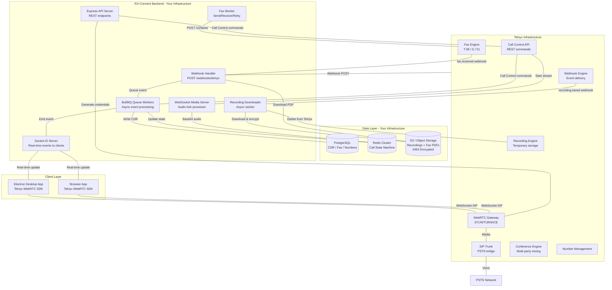

# RX-Connect: Complete Telnyx Integration Architecture & Migration Roadmap

**Classification:** Internal R&D — Architecture & Integration Planning  
**Role:** Senior Telecom Architect / VoIP Engineer / Telnyx Integration Consultant  
**Version:** 1.0  
**Date:** June 2026  
**Status:** Pre-Development — Architecture & Research Phase

---

## Table of Contents

1. [Existing FreeSWITCH Architecture Analysis](#1-existing-freeswitch-architecture-analysis)
2. [Telnyx Product Research & Capability Analysis](#2-telnyx-product-research--capability-analysis)
3. [Production Architecture Design](#3-production-architecture-design)
4. [Migration Strategy](#4-migration-strategy)
5. [Calling Flow Analysis](#5-calling-flow-analysis)
6. [API Deep Dive](#6-api-deep-dive)
7. [WebRTC Integration](#7-webrtc-integration)
8. [Backend Design (Node.js / Express / PostgreSQL / Redis)](#8-backend-design)
9. [Electron/Desktop Application Considerations](#9-electrondesktop-application-considerations)
10. [Compliance & Security (HIPAA)](#10-compliance--security)
11. [Cost Analysis](#11-cost-analysis)
12. [Fax over IP (FoIP) Research](#12-fax-over-ip-foip-research)
13. [Recommended Final Architecture](#13-recommended-final-architecture)

---

## 1. Existing FreeSWITCH Architecture Analysis

### 1.1 How a Typical FreeSWITCH Architecture Works

FreeSWITCH is an open-source, carrier-grade telephony platform that functions as a **back-to-back user agent (B2BUA)** — meaning it terminates every SIP leg and establishes a new one, giving it full call control. This is fundamentally different from a SIP proxy (like Kamailio), which forwards SIP packets without inspecting them.

```
┌─────────────────────────────────────────────────────────────────┐
│                     FreeSWITCH Core                             │
│                                                                 │
│  ┌──────────┐  ┌──────────┐  ┌──────────┐  ┌──────────┐       │
│  │  mod_sip │  │mod_sofia │  │mod_verto │  │ mod_event│       │
│  │  (SIP)   │  │(SIP/TLS) │  │(WebRTC)  │  │  Socket  │       │
│  └──────────┘  └──────────┘  └──────────┘  └──────────┘       │
│                                                                 │
│  ┌──────────┐  ┌──────────┐  ┌──────────┐  ┌──────────┐       │
│  │mod_record│  │ mod_ivr  │  │mod_conf  │  │mod_dptools│      │
│  │(Recording│  │ (IVR)    │  │(Conferencing│ │(Dialplan)│      │
│  └──────────┘  └──────────┘  └──────────┘  └──────────┘       │
│                                                                 │
│  ┌──────────────────────────────────────────────────────┐      │
│  │              Media Server (RTP/SRTP)                  │      │
│  │   Codec Transcoding | DTMF | MOH | TTS | ASR         │      │
│  └──────────────────────────────────────────────────────┘      │
└─────────────────────────────────────────────────────────────────┘
         │                    │                    │
   PSTN via SIP          WebSocket/Verto       ESL (Event
   Trunks (Upstream      browser clients       Socket Layer)
   SIP Providers)                              API to backend
```

FreeSWITCH uses an **event-driven architecture**. Its Event Socket Layer (ESL) allows a backend application to receive all call events (ringing, answered, hangup) and issue commands (bridge, transfer, record, hold) in real time. This is the closest architectural equivalent to Telnyx's Call Control API.

### 1.2 FreeSWITCH Responsibilities — Mapped to Telnyx Services

| FreeSWITCH Responsibility                | Component                            | Telnyx Equivalent                                 |
| ---------------------------------------- | ------------------------------------ | ------------------------------------------------- |
| SIP Trunk termination (inbound/outbound) | mod_sofia                            | Elastic SIP Trunking                              |
| Call routing / dialplan                  | dialplan XML                         | Call Control API + Webhook routing logic          |
| Media handling (RTP/SRTP)                | Media Server                         | Telnyx Media Infrastructure (carrier-layer)       |
| Codec transcoding                        | mod_sofia codecs                     | Telnyx handles automatically (G.711, G.722, Opus) |
| Call recording                           | mod_record / mod_shell_stream        | Telnyx Recording API                              |
| WebRTC browser calling                   | mod_verto                            | Telnyx WebRTC SDK (JS/React/iOS/Android)          |
| Conferencing                             | mod_conference                       | Telnyx Conference API                             |
| IVR / DTMF handling                      | mod_ivr / mod_dptools                | Call Control API (gather, speak, play)            |
| Music on hold                            | mod_local_stream                     | Call Control API (playback command)               |
| Real-time event delivery                 | ESL (Event Socket Layer)             | Telnyx Webhooks + WebSocket events                |
| Number management                        | External SIP provider + local config | Telnyx Number Management API                      |
| Call supervision / monitoring            | ESL eavesdrop                        | Call Control API (eavesdrop command)              |
| Fax (T.38)                               | mod_spandsp                          | Telnyx Programmable Fax API                       |
| TTS (Text to Speech)                     | mod_tts_commandline / mod_google_tts | Call Control API (speak command with TTS)         |
| STIR/SHAKEN                              | mod_opus + carrier                   | Telnyx native (built-in attestation)              |

### 1.3 Critical Architectural Differences

**FreeSWITCH (Self-hosted B2BUA):**

- All media flows through YOUR servers
- Full control but full operational burden (CPU, RAM, bandwidth, HA)
- ESL requires persistent TCP connection to your app
- Scaling = more FreeSWITCH instances + load balancer (e.g., OpenSIPS/Kamailio)
- You manage codecs, SRTP keys, NAT traversal, STUN/TURN

**Telnyx (Cloud-native CPaaS):**

- Media flows through Telnyx infrastructure (you never touch RTP packets unless you fork)
- Call Control is stateless HTTP — your backend is a webhook receiver
- Scaling = Telnyx handles it; you scale your webhook handlers
- No codec management, no SRTP key management, no NAT headaches
- You lose: ultra-low-latency custom media injection (only via streaming fork)

> **Hidden Risk #1:** If your FreeSWITCH architecture does custom DSP (Dynamic Speech Processing), voice activity detection, or real-time audio manipulation at the RTP level, this capability must be replaced with Telnyx's Media Streaming fork + your own WebSocket audio processor. Plan for this.

---

## 2. Telnyx Product Research & Capability Analysis

### 2.1 Elastic SIP Trunking

Telnyx operates its own private IP backbone — it is a **licensed carrier**, not a reseller. This is a critical distinction that directly impacts call quality, latency, and SLA guarantees.

**Technical Specs:**

- Supports both **credential-based** and **IP authentication**
- Up to **10,000 concurrent channels per trunk** (configurable)
- Codec support: G.711 (u-law/a-law), G.722, G.729, Opus, iLBC
- SRTP + TLS signaling supported natively
- STIR/SHAKEN attestation A/B/C levels
- Failover: automatic rerouting on media failure
- Elastic capacity: no pre-provisioned channel limits

**SIP Connection Types:**

```
1. Credential-Based: Username/password auth per SIP device
2. IP Authentication: Whitelist source IPs — better for server-to-server
3. Freeswitch Migration Path: Point existing FS trunks to Telnyx, zero code change
```

### 2.2 Call Control API

This is the **core of the Telnyx programmable voice platform** and the direct replacement for FreeSWITCH's ESL + dialplan system.

**How it works:**

1. Telnyx receives a call (inbound) or your backend initiates one (outbound)
2. Telnyx sends a **webhook** to your backend with `call.initiated` event
3. Your backend sends **commands** back to Telnyx via REST API
4. Telnyx executes the command (answer, transfer, record, etc.) and sends the next webhook
5. This continues for the entire call lifecycle

**Available Commands (complete list):**

| Command             | REST Endpoint                                   | Purpose                   |
| ------------------- | ----------------------------------------------- | ------------------------- |
| Answer              | POST /v2/calls/{id}/actions/answer              | Answer an inbound call    |
| Dial                | POST /v2/calls                                  | Initiate outbound call    |
| Bridge              | POST /v2/calls/{id}/actions/bridge              | Connect two call legs     |
| Transfer            | POST /v2/calls/{id}/actions/transfer            | Blind/attended transfer   |
| Hold                | POST /v2/calls/{id}/actions/hold                | Put call on hold with MOH |
| Unhold              | POST /v2/calls/{id}/actions/unhold              | Resume from hold          |
| Playback            | POST /v2/calls/{id}/actions/playback_start      | Play audio file           |
| Speak               | POST /v2/calls/{id}/actions/speak               | TTS with multiple voices  |
| Gather              | POST /v2/calls/{id}/actions/gather_using_speak  | Collect DTMF or speech    |
| Record Start        | POST /v2/calls/{id}/actions/record_start        | Start recording           |
| Record Stop         | POST /v2/calls/{id}/actions/record_stop         | Stop recording            |
| Streaming Start     | POST /v2/calls/{id}/actions/streaming_start     | Fork media to WebSocket   |
| Streaming Stop      | POST /v2/calls/{id}/actions/streaming_stop      | Stop media fork           |
| Transcription Start | POST /v2/calls/{id}/actions/transcription_start | Real-time STT             |
| Fork Start          | POST /v2/calls/{id}/actions/fork_start          | RTP media fork            |
| Eavesdrop           | POST /v2/calls/{id}/actions/eavesdrop           | Listen to active call     |
| Conference Join     | POST /v2/conferences/{id}/actions/join          | Add leg to conference     |
| Send DTMF           | POST /v2/calls/{id}/actions/send_dtmf           | Send DTMF tones           |
| Reject              | POST /v2/calls/{id}/actions/reject              | Reject inbound call       |
| Hangup              | POST /v2/calls/{id}/actions/hangup              | Terminate call            |
| Noise Suppression   | POST /v2/calls/{id}/actions/suppression_start   | AI noise suppression      |

**Key Concept — `call_control_id`:**
Every call has a unique `call_control_id`. ALL commands for that call use this ID. This is your primary handle for call management. Store it immediately on `call.initiated`.

**Key Concept — `client_state`:**
You can attach arbitrary base64-encoded state to any command, and Telnyx echoes it back on the next webhook. This is how you maintain call context without a round-trip to your database on every event.

### 2.3 WebRTC SDK

Telnyx provides first-party WebRTC SDKs that connect to their infrastructure:

**Available SDKs:**

- **JavaScript / TypeScript** (`@telnyx/webrtc`) — browsers + Electron
- **React** (wrapper around JS SDK)
- **iOS** (native Swift)
- **Android** (Kotlin + Firebase FCM for push)

**Connection Flow:**

```
Browser/Electron App
    ↓ (1) Login with Telnyx credentials or JWT
Telnyx WebRTC Gateway
    ↓ (2) SIP registration over WebSocket
    ↓ (3) Call placed → Telnyx PSTN/SIP
    ↓ (4) Webhook to your backend (call.initiated)
Your Backend
    ↓ (5) Issue Call Control commands
Telnyx (executes commands on media layer)
```

**Credential Types for WebRTC:**

- **SIP credentials** (username/password) — simpler, good for development
- **On-demand credentials** (generated via API) — better for production, short-lived

**Supported Codecs:**

- Opus (preferred for WebRTC — adaptive bitrate, 8–510 kbps)
- G.711 u-law / a-law (PSTN interop)

> **Important Limitation:** Telnyx WebRTC does NOT support peer-to-peer WebRTC between two browser clients. All media is relayed through Telnyx infrastructure. This is actually good for enterprise call recording compliance but means all calls incur Telnyx per-minute charges.

### 2.4 Voice API & TeXML

Telnyx offers **two paradigms** for voice programming:

**Call Control API (Recommended for RX-Connect):**

- Webhook-driven, fully imperative
- Your backend issues explicit commands per call event
- Maximum flexibility and control
- Requires stateful webhook handler

**TeXML:**

- Declarative XML returned from your webhook endpoint
- Similar to Twilio's TwiML
- Simpler flows, less flexible
- Good for legacy Twilio migrations
- **Not recommended for RX-Connect** — use Call Control

### 2.5 Number Management API

```
GET    /v2/available_phone_numbers     Search available numbers
POST   /v2/phone_numbers/orders        Purchase numbers
GET    /v2/phone_numbers               List owned numbers
PATCH  /v2/phone_numbers/{id}          Update routing/assignment
DELETE /v2/phone_numbers/{id}          Release numbers
POST   /v2/number_reservations         Reserve number temporarily
```

**Capabilities per number (configurable):**

- Voice (inbound/outbound)
- SMS/MMS
- Fax
- CNAM lookup
- Emergency services (E911)
- Call forwarding
- Porting (LNP — Local Number Portability)

**Number Types:**

- Local (area-code specific)
- Toll-free (800, 888, 877, 866, 855, 844, 833)
- International (100+ countries)

### 2.6 Messaging APIs

For RX-Connect messaging features:

```
POST /v2/messages              Send SMS/MMS
GET  /v2/messages/{id}         Get message status
POST /v2/messaging_profiles    Create messaging profile
```

**10DLC Compliance (US):**
All A2P SMS requires campaign registration. Telnyx handles 10DLC campaign submission but you must register your brand and use case. This is a **mandatory requirement** for any SMS functionality — budget 2–4 weeks for approval.

**Webhook Events:**

- `message.sent` — message submitted
- `message.delivered` — carrier confirmed delivery
- `message.failed` — delivery failure with error code

### 2.7 Recording API

Recording in Telnyx happens at the **carrier layer** — your servers never handle the audio stream for recording. This is a major operational advantage.

**Recording modes:**

- `record-from-answer` — records entire call from answer
- `record-from-ringing` — includes ringing phase
- Single-track (mixed) or dual-track (inbound/outbound channels separate)

**Storage:**

- Recordings stored on Telnyx infrastructure temporarily
- Download via provided URL (HTTPS, time-limited signed URL)
- Your responsibility: download and store in your own storage (S3, GCS) for retention
- Telnyx does NOT guarantee long-term storage — **download immediately on `call.recording.saved`**

**Recording Formats:**

- MP3 (default)
- WAV (request via `format` parameter)

**API:**

```
POST /v2/calls/{id}/actions/record_start
POST /v2/calls/{id}/actions/record_stop
GET  /v2/recordings/{id}
GET  /v2/recordings                        List all recordings
DELETE /v2/recordings/{id}                 Delete from Telnyx storage
```

### 2.8 Media Streaming API (Real-Time Fork)

This is Telnyx's most powerful feature for AI/analytics integration.

**Two modes:**

1. **WebSocket streaming** — base64-encoded audio sent to your WebSocket server in near-real-time
2. **RTP forking** — raw RTP stream delivered to your UDP endpoint

**WebSocket Payload:**

```json
{
  "event": "media",
  "sequence_number": "5",
  "media": {
    "track": "inbound",
    "chunk": "1",
    "timestamp": "5",
    "payload": "base64encodedRTPpayload"
  }
}
```

**Track options:**

- `inbound_track` — caller's audio only
- `outbound_track` — called party's audio only
- `both_tracks` — both channels (for transcription/sentiment analysis)

**Bidirectional streaming:**
You can inject audio back into the call via WebSocket, enabling real-time AI voice responses (GPT-4o / Claude voice synthesis). This is the architecture for AI voice agents.

> **Architecture Note:** The forked stream does NOT degrade the live call quality. Telnyx duplicates the media before forking. The secondary WebSocket recipient never occupies the call stream.

### 2.9 AI / Voice Agent Capabilities

Telnyx natively supports:

- **Real-time transcription** via `transcription_start` command (no external STT required)
- **TTS (Text-to-Speech)** via `speak` command (built-in voices + SSML support)
- **Noise suppression** via `suppression_start` command
- **Answering Machine Detection (AMD)** via `call.machine.detection.ended` webhook
- **Dialogflow integration** via streaming (pass Dialogflow connector URL)
- **Custom AI integration** via bidirectional WebSocket media streaming

**For RX-Connect AI features:**
Combine `streaming_start` → your WebSocket server → OpenAI Realtime API or Deepgram → inject response audio back via bidirectional stream.

### 2.10 Webhooks / Event System

**Webhook Security:**

- Telnyx signs every webhook with HMAC-SHA256 using your webhook API key
- Header: `telnyx-signature-ed25519` + `telnyx-timestamp`
- **Always verify webhook signatures** — reject unsigned payloads

**Webhook Delivery:**

- At-least-once delivery (implement idempotency keys)
- Retry on non-2xx response (exponential backoff)
- Timeout: your endpoint must respond within 5 seconds
- Use async processing: respond 200 OK immediately, process asynchronously

**Core Webhook Events (complete list):**

| Event                                | Trigger                                                  |
| ------------------------------------ | -------------------------------------------------------- |
| `call.initiated`                     | New inbound call arriving                                |
| `call.ringing`                       | Outbound call is ringing                                 |
| `call.answered`                      | Call connected                                           |
| `call.hangup`                        | Call terminated (includes `hangup_cause`, quality stats) |
| `call.bridged`                       | Two legs bridged                                         |
| `call.recording.saved`               | Recording file available for download                    |
| `call.playback.started`              | Audio playback began                                     |
| `call.playback.ended`                | Audio playback finished                                  |
| `call.gather.ended`                  | DTMF gather completed                                    |
| `call.dtmf.received`                 | Single DTMF digit received                               |
| `call.transfer`                      | Transfer initiated                                       |
| `call.machine.detection.ended`       | AMD completed                                            |
| `call.speak.started`                 | TTS began                                                |
| `call.speak.ended`                   | TTS completed                                            |
| `call.transcription`                 | Real-time transcript chunk                               |
| `call.fork.started`                  | Media fork active                                        |
| `call.fork.stopped`                  | Media fork stopped                                       |
| `call.eavesdrop.started`             | Monitoring/eavesdrop active                              |
| `call.conference.participant.joined` | User joined conference                                   |
| `call.conference.participant.left`   | User left conference                                     |
| `streaming.started`                  | WebSocket stream active                                  |
| `streaming.stopped`                  | WebSocket stream stopped                                 |
| `fax.queued`                         | Fax submission accepted                                  |
| `fax.sending`                        | Outbound fax transmitting                                |
| `fax.delivered`                      | Fax successfully sent                                    |
| `fax.failed`                         | Fax transmission failed                                  |
| `fax.received`                       | Inbound fax received                                     |
| `message.sent`                       | SMS/MMS sent                                             |
| `message.delivered`                  | SMS/MMS delivered                                        |
| `message.failed`                     | SMS/MMS failed                                           |

### 2.11 Authentication and Security

**API Key Types:**

- **V2 API Keys** — used for REST API calls (manage calls, numbers, etc.)
- **Webhook API Keys** — used for signature verification
- **On-demand WebRTC Credentials** — short-lived, generated per session

**Best Practices:**

- Store API keys in environment variables / secrets manager (never in code)
- Use separate API keys per environment (dev/staging/prod)
- Rotate keys quarterly
- Webhook signature verification is mandatory for HIPAA compliance
- All API calls must use HTTPS (TLS 1.2+)

---

## 3. Production Architecture Design

### 3.1 System Boundaries

```
┌─────────────────────────── RX-Connect Infrastructure ──────────────────────────┐
│                                                                                  │
│  ┌─────────────────┐    ┌─────────────────┐    ┌─────────────────────────────┐  │
│  │  Client Layer   │    │  Backend Layer  │    │      Data Layer             │  │
│  │                 │    │                 │    │                             │  │
│  │ ┌─────────────┐ │    │ ┌─────────────┐ │    │  ┌──────────┐ ┌──────────┐ │  │
│  │ │  Electron   │ │    │ │  API Server │ │    │  │PostgreSQL│ │  Redis   │ │  │
│  │ │  Desktop    │ │    │ │  (Express)  │ │    │  │  (Calls) │ │ (Cache/  │ │  │
│  │ │  App        │ │    │ │             │ │    │  │  (Fax)   │ │ Sessions)│ │  │
│  │ └─────────────┘ │    │ └─────────────┘ │    │  └──────────┘ └──────────┘ │  │
│  │                 │    │                 │    │                             │  │
│  │ ┌─────────────┐ │    │ ┌─────────────┐ │    │  ┌──────────────────────┐  │  │
│  │ │  Web Browser│ │    │ │  Webhook    │ │    │  │   Object Storage     │  │  │
│  │ │  (React)    │ │    │ │  Handler    │ │    │  │  (S3/GCS — Recordings│  │  │
│  │ └─────────────┘ │    │ └─────────────┘ │    │  │  + Fax Documents)   │  │  │
│  └─────────────────┘    │                 │    │  └──────────────────────┘  │  │
│          │              │ ┌─────────────┐ │    └─────────────────────────────┘  │
│          │ WebSocket    │ │  Socket.IO  │ │                   │                  │
│          │ (real-time   │ │  Server     │ │                   │                  │
│          │  call events)│ └─────────────┘ │                   │                  │
│          │              │                 │                   │                  │
│          │              │ ┌─────────────┐ │                   │                  │
│          └──────────────┤ │  WebSocket  │ │                   │                  │
│                         │ │  Media      │ │                   │                  │
│                         │ │  Processor  │ │                   │                  │
│                         │ │  (AI/STT)   │ │                   │                  │
│                         │ └─────────────┘ │                   │                  │
│                         └────────┬────────┘                   │                  │
└──────────────────────────────────│────────────────────────────│──────────────────┘
                                   │                            │
                    ┌──────────────┴─────────────────────┐      │
                    │           Telnyx Infrastructure     │      │
                    │                                     │      │
                    │  ┌──────────┐  ┌──────────────────┐│      │
                    │  │ Call     │  │  SIP Trunking    ││      │
                    │  │ Control  │  │  (PSTN Bridge)   ││      │
                    │  │ API      │  └──────────────────┘│      │
                    │  └──────────┘                       │      │
                    │  ┌──────────┐  ┌──────────────────┐│      │
                    │  │ WebRTC   │  │  Recording &     ││      │
                    │  │ Gateway  │  │  Media Fork      ││──────┘
                    │  └──────────┘  └──────────────────┘│  (downloads
                    │  ┌──────────┐  ┌──────────────────┐│   to your
                    │  │ Number   │  │  Fax API         ││   storage)
                    │  │ Mgmt     │  │  (T.38 / G.711)  ││
                    │  └──────────┘  └──────────────────┘│
                    │  ┌──────────┐  ┌──────────────────┐│
                    │  │ Webhooks │  │  Conferencing    ││
                    │  │ Engine   │  │  (multi-party)   ││
                    │  └──────────┘  └──────────────────┘│
                    └─────────────────────────────────────┘
                                   │
                              ┌────┴────┐
                              │  PSTN   │
                              │ Network │
                              └─────────┘
```

### 3.2 Service Responsibilities

**On RX-Connect Infrastructure:**

- Webhook handler (receives all Telnyx events)
- Call Control command issuer (sends commands to Telnyx REST API)
- Socket.IO server (real-time call status to browser/Electron clients)
- WebSocket media processor (receives forked audio for transcription/AI)
- Call state machine (tracks call lifecycle in Redis)
- Recording downloader (fetches recordings from Telnyx, stores to S3)
- Fax document processor (PDF → TIFF conversion, storage, routing)
- Database (PostgreSQL) — call records, fax records, number inventory
- Authentication (JWT for API access, on-demand credentials for WebRTC)

**On Telnyx Infrastructure:**

- SIP trunk termination (PSTN ingress/egress)
- Media handling (RTP/SRTP — you never touch this unless you fork)
- WebRTC gateway (STUN/TURN/ICE negotiation)
- Call recording storage (temporary — download immediately)
- Codec transcoding
- Conference mixing
- STIR/SHAKEN attestation
- Fax T.38 gateway
- Number provisioning

---

## 4. Migration Strategy

### 4.1 Phase-by-Phase Migration Plan

**Phase 0: Preparation (Weeks 1–2)**

- Create Telnyx Mission Control account
- Sign Business Associate Agreement (BAA) for HIPAA
- Provision test numbers (do NOT port production numbers yet)
- Set up API keys per environment (dev/staging/prod)
- Deploy webhook handler (HTTPS, publicly accessible)
- Configure webhook endpoint in Telnyx portal
- Verify webhook signature validation
- Establish monitoring/alerting baseline for current FreeSWITCH system

**Phase 1: Parallel Infrastructure (Weeks 3–6)**

- Deploy Telnyx SIP trunks alongside FreeSWITCH (not replacing)
- Implement Call Control API webhook handler (all 23 call events)
- Implement Redis call state machine
- Implement Socket.IO real-time event forwarding to clients
- Build outbound call flow (Dial API)
- Build inbound call flow (Answer + routing)
- Test with test numbers only — no production traffic
- Implement recording download pipeline to S3
- Unit test all webhook event handlers

**Phase 2: Feature Parity (Weeks 7–12)**

- Call transfer (blind and attended)
- Hold/unhold with custom music on hold
- Conference calling (multi-party)
- Call monitoring/eavesdrop
- DTMF IVR flows (gather command)
- TTS announcements (speak command)
- WebRTC client integration (Telnyx JS SDK in Electron)
- Number management (provision, release, CNAM)
- Fax API implementation (inbound + outbound)
- Real-time transcription (if applicable to your use case)

**Phase 3: Load Testing & Hardening (Weeks 13–15)**

- Load test webhook handler to 1,000 concurrent calls
- Test failover scenarios (webhook endpoint down, Telnyx API slow)
- Implement retry logic and dead letter queues
- Redis cluster for call state (single Redis is SPOF)
- Horizontal scaling of webhook handler (stateless design)
- Security audit: webhook signature validation, API key rotation
- HIPAA audit: PHI in logs, recording encryption, BAA review

**Phase 4: Soft Launch — New Numbers (Weeks 16–17)**

- Provision new DID numbers on Telnyx
- Route new numbers through Telnyx stack exclusively
- Run FreeSWITCH in parallel for existing numbers
- Monitor error rates, call quality (MOS scores from webhook), recording integrity
- Staff training on new system behavior

**Phase 5: Number Porting (Weeks 18–20)**

- Submit LNP (Local Number Portability) requests for production numbers
- Port numbers in batches (not all at once)
- LNP takes 3–10 business days per batch (plan accordingly)
- FreeSWITCH remains active as fallback until all numbers ported
- Verify each number post-port with inbound/outbound test calls

**Phase 6: FreeSWITCH Decommission (Week 21+)**

- Confirm zero traffic on FreeSWITCH
- Archive FreeSWITCH configuration (keep for 90 days)
- Terminate cloud instances / release on-prem hardware
- Update DNS, firewall rules, monitoring

### 4.2 Risks, Limitations, and Breaking Changes

**Risk: Webhook Latency**
FreeSWITCH ESL is a persistent TCP connection — sub-millisecond round trip. Telnyx webhooks are HTTP — typical round trip is 50–200ms. For time-sensitive operations (immediate answer on call.initiated), this adds latency. Mitigation: keep webhook handlers geographically close to Telnyx PoPs (Ashburn VA, Dallas TX, Amsterdam, Singapore).

**Risk: Webhook Delivery Failure**
If your webhook endpoint is down when Telnyx sends `call.initiated`, the call may not be answered. Mitigation: use a highly available webhook handler (multi-region, load balanced), implement health checks, and configure a fallback in Telnyx (e.g., voicemail or overflow to another number).

**Risk: State Loss on Restart**
In FreeSWITCH, call state lives in the FS process. In Telnyx + Call Control, your Redis holds call state. If Redis goes down mid-call, you lose the call_control_id and cannot issue commands. Mitigation: Redis Sentinel / Cluster with persistence enabled; persist call_control_id to PostgreSQL on `call.answered`.

**Risk: Recording Storage**
Telnyx does NOT guarantee recording persistence beyond a short window. You must download recordings immediately on `call.recording.saved`. Mitigation: implement an async worker that polls or reacts to the webhook and downloads within 60 seconds.

**Risk: LNP (Number Porting) Downtime**
During port, there is a brief window where calls may fail. Mitigation: port during off-peak hours, have rollback plan (re-point numbers to FreeSWITCH if port fails).

**Breaking Changes:**

1. **Call identification** changes from FreeSWITCH UUID to Telnyx `call_control_id` + `call_leg_id` + `call_session_id`
2. **Event model** changes from ESL push to webhook pull (your app must be externally reachable)
3. **Recording format** changes — verify your downstream processing handles Telnyx's MP3/WAV format
4. **DTMF handling** is explicit gather command vs FS passive DTMF capture
5. **Conference** — FS `mod_conference` vs Telnyx Conference API (different room ID model)

### 4.3 Features Requiring Redesign

| FreeSWITCH Feature                                  | Redesign Required                                   |
| --------------------------------------------------- | --------------------------------------------------- |
| Custom audio DSP / RTP manipulation                 | Must use media streaming fork to your own processor |
| Dialplan XML routing logic                          | Rewrite as Node.js routing logic in webhook handler |
| ESL event subscriptions                             | Replace with webhook event handlers per event type  |
| Custom codecs (e.g., SILK, G.729 with your license) | Use Telnyx's supported codec set                    |
| FreeSWITCH modules (mod_xml_curl, etc.)             | Replace with API calls to your own backend          |
| Inline DTMF detection mid-audio                     | Use `gather` command with `termination_key`         |

---

## 5. Calling Flow Analysis

### 5.1 Incoming Call Flow

```
PSTN Caller
    │
    │ (1) Call arrives at Telnyx DID
    ▼
Telnyx Network
    │
    │ (2) POST /webhook → call.initiated
    │     { call_control_id, from, to, direction: "inbound" }
    ▼
RX-Connect Webhook Handler
    │
    │ (3) Respond HTTP 200 immediately
    │ (4) Async: look up routing rules (who owns this DID?)
    │ (5) POST /v2/calls/{id}/actions/answer
    │
    ▼
Telnyx (answers call)
    │
    │ (6) POST /webhook → call.answered
    ▼
RX-Connect Webhook Handler
    │
    │ (7) POST /v2/calls/{id}/actions/speak (greeting)
    │     OR
    │     POST /v2/calls/{id}/actions/gather_using_speak (IVR menu)
    │     OR
    │     POST /v2/calls/{id}/actions/bridge (to agent)
    │
    │ (8) Emit via Socket.IO to agent UI: new_inbound_call event
    ▼
Agent Client (Electron/Browser)
    │
    │ (9) Agent clicks "Accept"
    │     → Their WebRTC client is already registered to Telnyx
    │     → Bridge happens at Telnyx level (both legs connected)
    ▼
Active Call (PSTN Caller ↔ Telnyx ↔ Agent WebRTC)
```

### 5.2 Outgoing Call Flow

```
Agent (Electron/Browser)
    │
    │ (1) Agent clicks "Dial" with target number
    ▼
RX-Connect Backend (Express API)
    │
    │ (2) POST /v2/calls
    │     {
    │       connection_id: "...",
    │       to: "+15551234567",
    │       from: "+18005550100",  ← your DID
    │       webhook_url: "https://yourdomain.com/webhooks/telnyx",
    │       client_state: base64({"call_type": "outbound", "agent_id": "agent-123"})
    │     }
    ▼
Telnyx
    │
    │ (3) Dials PSTN number
    │ (4) POST /webhook → call.initiated (direction: "outbound")
    │ (5) POST /webhook → call.ringing
    ▼
RX-Connect Webhook Handler
    │
    │ (6) Emit Socket.IO → agent client: call_ringing
    │
    │ (7) PSTN party answers
    │ (8) POST /webhook → call.answered
    ▼
RX-Connect Webhook Handler
    │
    │ (9) If two-legged call (agent WebRTC + PSTN):
    │     Already bridged at dial time (use "from" as WebRTC SIP URI)
    │     OR
    │     POST /v2/calls/{agent_call_id}/actions/bridge
    │         {call_control_id: outbound_call_control_id}
    │
    │ (10) Start recording if policy requires
    │      POST /v2/calls/{id}/actions/record_start
    ▼
Active Call (Agent ↔ Telnyx ↔ PSTN Party)
```

### 5.3 Call Transfer

**Blind Transfer (no announcement):**

```
POST /v2/calls/{call_control_id}/actions/transfer
{
  "to": "+15559876543",        ← transfer destination
  "from": "+18005550100",
  "audio_url": "https://your-cdn/hold-music.mp3"  ← optional MOH during transfer
}
```

Webhooks: `call.transfer` → (on new leg) `call.initiated` → `call.answered`

**Attended Transfer (warm transfer — agent speaks to transfer target first):**

1. Agent calls transfer target: `POST /v2/calls` (new outbound leg)
2. Original caller is placed on hold: `POST /v2/calls/{original_id}/actions/hold`
3. Agent speaks to transfer target
4. Agent confirms: `POST /v2/calls/{original_id}/actions/bridge` (to transfer target's call_control_id)
5. Agent's leg hangs up automatically after bridge

### 5.4 Hold and Resume

```
// Put on hold (plays MOH audio URL)
POST /v2/calls/{call_control_id}/actions/hold
{
  "audio_url": "https://your-cdn/moh.mp3"
}
// Webhook: call.hold (not currently a separate event — inferred from bridge state)

// Take off hold
POST /v2/calls/{call_control_id}/actions/unhold
// Webhook: call.answered (re-bridged)
```

> **Hidden Detail:** Telnyx plays the audio_url on loop during hold. Ensure your MOH audio URL is stable and accessible from Telnyx's network. Self-sign URLs with expiry for HIPAA compliance (prevent unauthorized access to audio).

### 5.5 Conference Calls

```
// Step 1: Create conference room
POST /v2/conferences
{
  "name": "RX-Connect-Conf-{uuid}",
  "call_control_id": "first_participant_call_control_id",
  "beep_enabled": "enter_and_exit",
  "hold_audio_url": "https://your-cdn/conf-moh.mp3"
}
// Response: { "id": "conference_id", ... }

// Step 2: Add more participants (they must have active call legs)
POST /v2/conferences/{conference_id}/actions/join
{
  "call_control_id": "second_participant_call_control_id"
}

// Step 3: Mute a participant
POST /v2/conferences/{conference_id}/actions/mute
{
  "call_control_ids": ["call_control_id_to_mute"]
}

// Step 4: Remove a participant
POST /v2/conferences/{conference_id}/actions/leave
{
  "call_control_id": "..."
}

// Webhooks:
// call.conference.participant.joined
// call.conference.participant.left
// call.conference.ended
```

### 5.6 Call Recording

```
// Start recording (dual-track recommended for compliance)
POST /v2/calls/{call_control_id}/actions/record_start
{
  "format": "mp3",              // or "wav"
  "channels": "dual",           // "single" (mixed) or "dual" (separate tracks)
  "play_beep": true,            // HIPAA: notify parties recording is active
  "trim": "trim-silence"        // optional
}

// Recording saved webhook:
{
  "event_type": "call.recording.saved",
  "payload": {
    "recording_urls": {
      "mp3": "https://storage.telnyx.com/recordings/{id}.mp3"  ← signed URL
    },
    "duration_secs": 147,
    "call_leg_id": "..."
  }
}

// Your backend MUST immediately download this file:
// GET {recording_url} → save to S3/GCS with encryption
// Then: DELETE /v2/recordings/{id}  ← remove from Telnyx storage

// Stop recording mid-call
POST /v2/calls/{call_control_id}/actions/record_stop
```

### 5.7 Call Monitoring (Eavesdrop / Barge / Whisper)

```
// Supervisor eavesdrop (listen only — silent to both parties)
POST /v2/calls/{call_control_id}/actions/eavesdrop
{
  "call_control_id": "supervisor_call_control_id",
  "whisper_type": "none"        // listen only
}

// Whisper to agent only (patient cannot hear supervisor)
POST /v2/calls/{call_control_id}/actions/eavesdrop
{
  "call_control_id": "supervisor_call_control_id",
  "whisper_type": "outbound"    // supervisor speaks to agent only
}

// Barge (join call — all parties hear each other)
POST /v2/calls/{call_control_id}/actions/eavesdrop
{
  "call_control_id": "supervisor_call_control_id",
  "whisper_type": "both"
}

// Webhooks: call.eavesdrop.started
```

> **Compliance Note (HIPAA):** Eavesdrop sessions on patient calls must be logged in your audit trail. Track who initiated the eavesdrop, when, on which call, and the reason.

### 5.8 Call Status Tracking

Maintain a state machine in Redis:

```
States: INITIATED → RINGING → ANSWERED → [ON_HOLD | IN_CONFERENCE | RECORDING] → HANGUP

Redis key: call:{call_control_id}
Fields:
  - state: string
  - call_leg_id: string
  - call_session_id: string
  - from: string
  - to: string
  - direction: string
  - answered_at: timestamp
  - hold_started_at: timestamp
  - agent_id: string
  - recording_id: string
  - conference_id: string
  - client_state: string (decoded)
  TTL: 24 hours (auto-expire abandoned call records)
```

On each webhook event, update this Redis record and emit to Socket.IO:

```javascript
io.to(`agent:${agentId}`).emit('call_state_update', {
  callControlId,
  state: newState,
  timestamp: new Date().toISOString(),
});
```

### 5.9 Call Termination

```
// Your backend terminates call:
POST /v2/calls/{call_control_id}/actions/hangup
{
  "hangup_cause": "NORMAL_CLEARING"
}

// Telnyx terminates (party hangs up):
// Webhook: call.hangup
{
  "event_type": "call.hangup",
  "payload": {
    "hangup_cause": "normal_clearing",
    "hangup_source": "callee",   // or "caller"
    "sip_hangup_cause": "200",
    "call_quality_stats": {
      "inbound": {
        "mos": "4.20",           // Mean Opinion Score (1.0–5.0)
        "jitter_max_variance": "12.5",
        "packet_count": "1200"
      }
    },
    "start_time": "...",
    "end_time": "...",
    "duration": 145
  }
}
```

On hangup, your backend should:

1. Update Redis call state to HANGUP
2. Write final CDR (Call Detail Record) to PostgreSQL
3. Emit Socket.IO event to agent/admin UI
4. Trigger recording download worker (if recording was active)
5. Calculate billable duration for internal cost tracking

### 5.10 Number Provisioning

```
// Search available numbers
GET /v2/available_phone_numbers?filter[country_code]=US
                               &filter[national_destination_code]=312  // area code
                               &filter[features][]=voice
                               &filter[features][]=sms
                               &filter[features][]=fax
                               &filter[limit]=20

// Purchase
POST /v2/phone_numbers/orders
{
  "phone_numbers": [
    { "phone_number": "+13125550199" }
  ],
  "connection_id": "your_call_control_connection_id"
}

// Assign to fax application
PATCH /v2/phone_numbers/{id}
{
  "connection_id": "fax_application_id",
  "messaging_profile_id": "...",
  "emergency_address_id": "..."  // E911
}
```

---

## 6. API Deep Dive

### 6.1 API Reference with Request/Response Examples

**Initiate Outbound Call:**

```http
POST https://api.telnyx.com/v2/calls
Authorization: Bearer YOUR_TELNYX_API_KEY
Content-Type: application/json

{
  "connection_id": "1684641123236054244",
  "to": "+15551234567",
  "from": "+18005550100",
  "from_display_name": "RX-Connect",
  "webhook_url": "https://rxconnect.yourdomain.com/webhooks/telnyx",
  "webhook_url_method": "POST",
  "client_state": "eyJhZ2VudElkIjoiYWdlbnQtMTIzIn0=",  // base64 JSON
  "timeout_secs": 60,
  "answering_machine_detection": "detect",
  "answering_machine_detection_config": {
    "total_analysis_time_millis": 5000,
    "after_greeting_silence_millis": 800,
    "machine_words_threshold": 6
  }
}

// Response:
{
  "data": {
    "call_control_id": "v3:RzaeMnE9...",
    "call_leg_id": "aebb45bc-87dd-11f0-9d4e-02420a1f0b69",
    "call_session_id": "aeb5639a-87dd-11f0-af54-02420a1f0b69",
    "record_type": "call",
    "is_alive": true
  }
}
```

**Answer Inbound Call:**

```http
POST https://api.telnyx.com/v2/calls/{call_control_id}/actions/answer
Authorization: Bearer YOUR_TELNYX_API_KEY
Content-Type: application/json

{
  "client_state": "eyJyb3V0aW5nIjoidHJpYWdlIn0=",
  "command_id": "891510ac-f3e4-11e8-af5b-de00688a4901"  // idempotency key
}
```

**Bridge Two Legs:**

```http
POST https://api.telnyx.com/v2/calls/{call_control_id}/actions/bridge
Authorization: Bearer YOUR_TELNYX_API_KEY
Content-Type: application/json

{
  "call_control_id": "other_leg_call_control_id",
  "park_after_unbridge": "self",
  "client_state": "eyJicmlkZ2VkIjp0cnVlfQ=="
}
```

**Start Recording:**

```http
POST https://api.telnyx.com/v2/calls/{call_control_id}/actions/record_start
Authorization: Bearer YOUR_TELNYX_API_KEY
Content-Type: application/json

{
  "format": "mp3",
  "channels": "dual",
  "play_beep": true,
  "max_length": 3600,          // max 1 hour
  "timeout_secs": 0,           // 0 = no silence timeout
  "trim": "do-not-trim",
  "client_state": "eyJyZWNvcmRpbmciOnRydWV9"
}
```

**Gather DTMF (IVR):**

```http
POST https://api.telnyx.com/v2/calls/{call_control_id}/actions/gather_using_speak
Authorization: Bearer YOUR_TELNYX_API_KEY
Content-Type: application/json

{
  "language": "en-US",
  "voice": "female",
  "payload": "Press 1 for appointments, 2 for prescriptions, or 3 for billing.",
  "valid_digits": "123",
  "min_digits": 1,
  "max_digits": 1,
  "timeout_millis": 10000,
  "inter_digit_timeout_millis": 5000,
  "terminating_digit": "#",
  "client_state": "eyJzdGVwIjoiaXZyX21lbnUifQ=="
}

// Resulting webhook: call.gather.ended
{
  "event_type": "call.gather.ended",
  "payload": {
    "digits": "1",
    "status": "valid",
    "call_control_id": "...",
    "client_state": "eyJzdGVwIjoiaXZyX21lbnUifQ=="
  }
}
```

**Start Media Streaming (WebSocket):**

```http
POST https://api.telnyx.com/v2/calls/{call_control_id}/actions/streaming_start
Authorization: Bearer YOUR_TELNYX_API_KEY
Content-Type: application/json

{
  "stream_url": "wss://media.rxconnect.yourdomain.com/streams",
  "stream_track": "both_tracks",
  "enable_dialogflow": false,
  "stream_bidirectional_mode": "rtp",   // for AI voice injection
  "client_state": "eyJzdHJlYW1pbmciOnRydWV9"
}
```

### 6.2 Webhook Processing Pipeline

```javascript
// Express webhook handler (simplified)
app.post('/webhooks/telnyx', express.raw({ type: 'application/json' }), async (req, res) => {
  // 1. Verify signature FIRST
  const signature = req.headers['telnyx-signature-ed25519'];
  const timestamp = req.headers['telnyx-timestamp'];

  if (!verifyTelnyxSignature(req.body, signature, timestamp)) {
    return res.status(403).json({ error: 'Invalid signature' });
  }

  // 2. Respond immediately
  res.status(200).json({ received: true });

  // 3. Process asynchronously
  const event = JSON.parse(req.body);
  await callEventQueue.add('process_call_event', event, {
    attempts: 3,
    backoff: { type: 'exponential', delay: 1000 },
  });
});
```

---

## 7. WebRTC Integration

### 7.1 Architecture Comparison: SIP vs Call Control API

**Option A: Pure SIP Approach**

- Register a SIP endpoint directly against Telnyx SIP infrastructure
- Your Electron/browser app acts as a SIP softphone
- Telnyx handles signaling; you get SIP events (INVITE, BYE, etc.)
- Less programmatic control — limited to what SIP allows
- **Not recommended for RX-Connect**

**Option B: Telnyx WebRTC SDK + Call Control API (Recommended)**

- Browser/Electron registers with Telnyx via WebRTC SDK using credentials
- Inbound/outbound calls trigger webhooks to your backend
- Your backend uses Call Control API for all programmatic operations
- Full bidirectional control: you can answer, transfer, record, monitor any call
- WebRTC SDK handles all ICE/STUN/TURN/codec negotiation transparently

**Option C: Custom SIP via SIP.js or JsSIP**

- Use a generic SIP library, point at Telnyx SIP infrastructure
- More flexible but requires much more SIP expertise
- Handle ICE negotiation, DTMF, re-INVITE yourself
- **Only viable if Telnyx WebRTC SDK lacks a feature you need**

### 7.2 Recommended: Telnyx WebRTC SDK + Call Control

**Setup Flow:**

```javascript
// 1. Backend generates on-demand WebRTC credentials
// POST /v2/telephony_credentials
const credResponse = await telnyxClient.post('/v2/telephony_credentials', {
  connection_id: process.env.TELNYX_CONNECTION_ID,
});
// Returns: { id, sip_username, sip_password, expires_at }

// 2. Pass credentials to Electron/Browser client via your API
// (short-lived — re-generate on expiry, never expose permanent API keys to client)

// 3. In Electron/Browser:
import { TelnyxRTC } from '@telnyx/webrtc';

const client = new TelnyxRTC({
  login: sipUsername,
  password: sipPassword,
  ringtoneFile: '/audio/ring.mp3',
  ringbackFile: '/audio/ringback.mp3',
});

client.on('telnyx.ready', () => {
  console.log('WebRTC registered with Telnyx');
  socketIO.emit('agent_ready', { agentId });
});

client.on('telnyx.call.incoming', (call) => {
  // Inbound call arriving
  // Simultaneously, your backend receives call.initiated webhook
  // and emits via Socket.IO — both should agree on callControlId
  call.answer(); // or call.reject()
});

client.on('telnyx.error', (error) => {
  // Handle reconnection (see section 9)
});

client.connect();

// 4. Outbound call
const call = client.newCall({
  destinationNumber: '+15551234567',
  callerNumber: '+18005550100',
});
```

### 7.3 Electron-Specific WebRTC Configuration

```javascript
// main.js — Electron main process
const { app, BrowserWindow, session } = require('electron');

app.whenReady().then(() => {
  // Grant microphone/camera permissions automatically (no OS prompt in Electron)
  session.defaultSession.setPermissionRequestHandler((webContents, permission, callback) => {
    if (permission === 'media' || permission === 'audioCapture') {
      callback(true); // Grant automatically
    } else {
      callback(false);
    }
  });

  const win = new BrowserWindow({
    webPreferences: {
      contextIsolation: true,
      nodeIntegration: false,
      preload: path.join(__dirname, 'preload.js'),
    },
  });

  // Required for WebRTC in Electron
  app.commandLine.appendSwitch('enable-features', 'WebRTC-H264WithOpenH264FFmpeg');
  app.commandLine.appendSwitch('use-fake-ui-for-media-stream'); // REMOVE in production
});
```

---

## 8. Backend Design

### 8.1 Module Architecture

```
rxconnect-backend/
├── src/
│   ├── modules/
│   │   ├── telnyx/
│   │   │   ├── webhook.handler.js       ← receives all Telnyx events
│   │   │   ├── call.controller.js       ← issues Call Control commands
│   │   │   ├── number.manager.js        ← number provisioning
│   │   │   ├── conference.manager.js    ← conference room management
│   │   │   ├── recording.manager.js     ← recording lifecycle
│   │   │   ├── fax.manager.js           ← fax send/receive
│   │   │   └── signature.verifier.js   ← webhook signature validation
│   │   ├── call-state/
│   │   │   ├── state.machine.js         ← Redis-backed call state
│   │   │   └── cdr.writer.js            ← PostgreSQL CDR writer
│   │   ├── media/
│   │   │   ├── websocket.server.js      ← receives forked audio
│   │   │   ├── transcription.client.js  ← sends to STT (Deepgram/Telnyx)
│   │   │   └── recording.downloader.js  ← fetches + stores recordings
│   │   ├── realtime/
│   │   │   └── socket.gateway.js        ← Socket.IO event router to clients
│   │   └── auth/
│   │       └── credential.generator.js  ← WebRTC on-demand creds
│   ├── queues/
│   │   ├── call.events.queue.js         ← Bull/BullMQ queue for webhooks
│   │   └── recording.download.queue.js  ← async recording download
│   ├── db/
│   │   ├── migrations/
│   │   └── models/
│   │       ├── call.model.js
│   │       ├── fax.model.js
│   │       └── number.model.js
│   └── config/
│       └── telnyx.config.js
```

### 8.2 Database Schema

```sql
-- Call Detail Records
CREATE TABLE calls (
  id                UUID PRIMARY KEY DEFAULT gen_random_uuid(),
  call_control_id   TEXT NOT NULL UNIQUE,
  call_leg_id       TEXT NOT NULL,
  call_session_id   TEXT NOT NULL,
  direction         TEXT NOT NULL CHECK (direction IN ('inbound', 'outbound')),
  from_number       TEXT NOT NULL,
  to_number         TEXT NOT NULL,
  status            TEXT NOT NULL DEFAULT 'initiated',
  agent_id          UUID REFERENCES users(id),
  initiated_at      TIMESTAMPTZ NOT NULL DEFAULT NOW(),
  answered_at       TIMESTAMPTZ,
  hangup_at         TIMESTAMPTZ,
  duration_secs     INTEGER,
  hangup_cause      TEXT,
  hangup_source     TEXT,
  mos_score         DECIMAL(3,2),
  recording_id      TEXT,
  recording_url     TEXT,          -- internal S3 URL (after download)
  conference_id     TEXT,
  transferred_to    TEXT,
  client_state      JSONB,
  created_at        TIMESTAMPTZ DEFAULT NOW(),
  updated_at        TIMESTAMPTZ DEFAULT NOW()
);

CREATE INDEX idx_calls_agent_id ON calls(agent_id);
CREATE INDEX idx_calls_initiated_at ON calls(initiated_at);
CREATE INDEX idx_calls_from_number ON calls(from_number);
CREATE INDEX idx_calls_status ON calls(status);

-- Call Events Audit Log (for HIPAA)
CREATE TABLE call_events (
  id              UUID PRIMARY KEY DEFAULT gen_random_uuid(),
  call_id         UUID REFERENCES calls(id),
  event_type      TEXT NOT NULL,
  payload         JSONB NOT NULL,
  received_at     TIMESTAMPTZ NOT NULL DEFAULT NOW()
);

CREATE INDEX idx_call_events_call_id ON call_events(call_id);
CREATE INDEX idx_call_events_received_at ON call_events(received_at);

-- Phone Numbers
CREATE TABLE phone_numbers (
  id                    UUID PRIMARY KEY DEFAULT gen_random_uuid(),
  telnyx_number_id      TEXT NOT NULL UNIQUE,
  phone_number          TEXT NOT NULL UNIQUE,
  type                  TEXT NOT NULL,   -- 'local', 'toll-free', 'international'
  capabilities          TEXT[] NOT NULL, -- ['voice', 'sms', 'fax']
  connection_id         TEXT,
  assigned_to_type      TEXT,            -- 'agent', 'department', 'fax'
  assigned_to_id        UUID,
  status                TEXT DEFAULT 'active',
  monthly_cost          DECIMAL(8,4),
  purchased_at          TIMESTAMPTZ,
  created_at            TIMESTAMPTZ DEFAULT NOW()
);

-- Fax Records
CREATE TABLE faxes (
  id                UUID PRIMARY KEY DEFAULT gen_random_uuid(),
  telnyx_fax_id     TEXT UNIQUE,
  direction         TEXT NOT NULL CHECK (direction IN ('inbound', 'outbound')),
  from_number       TEXT NOT NULL,
  to_number         TEXT NOT NULL,
  status            TEXT NOT NULL DEFAULT 'queued',
  page_count        INTEGER,
  quality           TEXT DEFAULT 'normal',
  media_url         TEXT,           -- Telnyx temporary URL
  storage_url       TEXT,           -- Internal S3 URL
  storage_key       TEXT,           -- S3 object key
  failed_reason     TEXT,
  retry_count       INTEGER DEFAULT 0,
  max_retries       INTEGER DEFAULT 3,
  next_retry_at     TIMESTAMPTZ,
  sent_at           TIMESTAMPTZ,
  received_at       TIMESTAMPTZ,
  created_by        UUID REFERENCES users(id),
  created_at        TIMESTAMPTZ DEFAULT NOW(),
  updated_at        TIMESTAMPTZ DEFAULT NOW()
);

CREATE INDEX idx_faxes_direction ON faxes(direction);
CREATE INDEX idx_faxes_status ON faxes(status);
CREATE INDEX idx_faxes_created_at ON faxes(created_at);

-- Conferences
CREATE TABLE conferences (
  id                UUID PRIMARY KEY DEFAULT gen_random_uuid(),
  telnyx_conf_id    TEXT UNIQUE,
  name              TEXT NOT NULL,
  status            TEXT DEFAULT 'active',
  created_by        UUID REFERENCES users(id),
  started_at        TIMESTAMPTZ DEFAULT NOW(),
  ended_at          TIMESTAMPTZ,
  participant_count INTEGER DEFAULT 0
);

-- Recording Storage Index
CREATE TABLE recordings (
  id              UUID PRIMARY KEY DEFAULT gen_random_uuid(),
  call_id         UUID REFERENCES calls(id),
  telnyx_rec_id   TEXT UNIQUE,
  storage_bucket  TEXT NOT NULL,
  storage_key     TEXT NOT NULL,
  format          TEXT NOT NULL,   -- 'mp3', 'wav'
  channels        TEXT NOT NULL,   -- 'single', 'dual'
  duration_secs   INTEGER,
  size_bytes      BIGINT,
  downloaded_at   TIMESTAMPTZ,
  deleted_from_telnyx BOOLEAN DEFAULT false,
  created_at      TIMESTAMPTZ DEFAULT NOW()
);
```

### 8.3 Call State Machine (Redis)

```javascript
// state.machine.js
const CALL_STATES = {
  INITIATED: 'initiated',
  RINGING: 'ringing',
  ANSWERED: 'answered',
  ON_HOLD: 'on_hold',
  IN_CONFERENCE: 'in_conference',
  RECORDING: 'recording',
  TRANSFERRING: 'transferring',
  HANGUP: 'hangup',
};

const VALID_TRANSITIONS = {
  initiated: ['ringing', 'answered', 'hangup'],
  ringing: ['answered', 'hangup'],
  answered: ['on_hold', 'in_conference', 'recording', 'transferring', 'hangup'],
  on_hold: ['answered', 'hangup'],
  in_conference: ['answered', 'hangup'],
  recording: ['answered', 'on_hold', 'hangup'],
  transferring: ['hangup'],
  hangup: [],
};

class CallStateMachine {
  constructor(redis) {
    this.redis = redis;
    this.TTL = 86400; // 24 hours
  }

  key(callControlId) {
    return `call:${callControlId}`;
  }

  async set(callControlId, data) {
    await this.redis.setex(this.key(callControlId), this.TTL, JSON.stringify(data));
  }

  async get(callControlId) {
    const raw = await this.redis.get(this.key(callControlId));
    return raw ? JSON.parse(raw) : null;
  }

  async transition(callControlId, newState) {
    const current = await this.get(callControlId);
    if (!current) throw new Error(`Call not found: ${callControlId}`);

    const valid = VALID_TRANSITIONS[current.state];
    if (!valid.includes(newState)) {
      throw new Error(`Invalid transition: ${current.state} → ${newState}`);
    }

    current.state = newState;
    current.updatedAt = new Date().toISOString();
    await this.set(callControlId, current);
    return current;
  }
}
```

### 8.4 Recording Download Worker

```javascript
// recording.downloader.js
async function downloadRecording(recordingUrl, callControlId, recordingId) {
  const s3Key = `recordings/${new Date().getFullYear()}/${callControlId}/${recordingId}.mp3`;

  // Stream download directly to S3 (never store on disk in plaintext)
  const response = await axios({
    method: 'GET',
    url: recordingUrl,
    responseType: 'stream',
    headers: { Authorization: `Bearer ${process.env.TELNYX_API_KEY}` },
  });

  const upload = s3.upload({
    Bucket: process.env.RECORDINGS_BUCKET,
    Key: s3Key,
    Body: response.data,
    ContentType: 'audio/mpeg',
    ServerSideEncryption: 'aws:kms', // HIPAA: encrypt at rest
    SSEKMSKeyId: process.env.KMS_KEY_ID,
    Metadata: {
      callControlId,
      recordingId,
      downloadedAt: new Date().toISOString(),
    },
  });

  await upload.promise();

  // Update DB
  await db.recordings.update(
    { telnyx_rec_id: recordingId },
    {
      storage_bucket: process.env.RECORDINGS_BUCKET,
      storage_key: s3Key,
      downloaded_at: new Date(),
    },
  );

  // Delete from Telnyx storage
  await telnyxClient.delete(`/v2/recordings/${recordingId}`);

  return s3Key;
}
```

---

## 9. Electron/Desktop Application Considerations

### 9.1 Microphone Handling

```javascript
// Enumerate audio devices
async function getAudioDevices() {
  const devices = await navigator.mediaDevices.enumerateDevices();
  return {
    microphones: devices.filter((d) => d.kind === 'audioinput'),
    speakers: devices.filter((d) => d.kind === 'audiooutput'),
  };
}

// Set input device on Telnyx WebRTC client
client.setAudioSettings({
  inDeviceId: selectedMicrophoneDeviceId,
  outDeviceId: selectedSpeakerDeviceId,
  micFaultDetectionEnabled: true, // detect mic disconnect
  echoCancellation: true,
  noiseSuppression: true,
  autoGainControl: true,
});
```

### 9.2 Device Permission Handling

In Electron, you must handle permissions in the main process:

```javascript
// In main.js — grant permissions declaratively
session.defaultSession.setPermissionCheckHandler((webContents, permission) => {
  if (permission === 'media') return true;
  return false;
});

// Monitor device changes (headset plug/unplug)
navigator.mediaDevices.addEventListener('devicechange', async () => {
  const devices = await getAudioDevices();
  ipcRenderer.send('audio-devices-changed', devices);
  // Auto-switch to new default device or notify user
});
```

### 9.3 Call Lifecycle Management in Electron

```javascript
// Prevent app closure during active call
app.on('before-quit', (event) => {
  if (activeCallExists()) {
    event.preventDefault();
    dialog
      .showMessageBox({
        type: 'warning',
        message: 'You have an active call. Please hang up before closing.',
        buttons: ['Stay', 'Hang Up & Close'],
      })
      .then(({ response }) => {
        if (response === 1) {
          hangupActiveCall().then(() => app.quit());
        }
      });
  }
});

// Handle system sleep (call will drop — notify user)
powerMonitor.on('suspend', () => {
  if (activeCallExists()) {
    showNotification('System sleeping — call may disconnect');
    // Attempt graceful hangup
    hangupActiveCall();
  }
});
```

### 9.4 Background Calling

```javascript
// Keep app alive in system tray
app.on('window-all-closed', (event) => {
  if (process.platform !== 'darwin') {
    if (activeCallExists()) {
      event.preventDefault(); // Stay alive for call
    }
    // else: app.quit() runs naturally
  }
});

// Show call overlay when window is minimized
ipcMain.on('call-incoming', () => {
  if (!win.isVisible()) {
    win.show();
    win.focus();
    // Flash taskbar/dock
    app.dock?.bounce('critical');
  }
});
```

### 9.5 Reconnection Handling

```javascript
client.on('telnyx.socket.close', () => {
  // WebRTC disconnected — implement exponential backoff reconnect
  let retryDelay = 1000;
  const maxRetry = 30000;

  const reconnect = () => {
    client.connect();
    retryDelay = Math.min(retryDelay * 2, maxRetry);
  };

  const scheduleReconnect = () => {
    setTimeout(() => {
      if (!client.isConnected()) {
        reconnect();
        scheduleReconnect();
      }
    }, retryDelay);
  };

  scheduleReconnect();
});

// Detect network change and force reconnect
window.addEventListener('online', () => {
  if (!client.isConnected()) client.connect();
});
```

### 9.6 Audio Quality Optimization

- **Codec:** Use Opus (default in Telnyx WebRTC) — adaptive bitrate, handles packet loss
- **Jitter buffer:** Handled by browser WebRTC stack
- **Echo cancellation:** Enable via `getUserMedia` constraints
- **Network priority:** In Electron, use `setNetworkServicePriority` or DSCP marking if on corporate network
- **Monitor MOS:** Parse `call_quality_stats` from `call.hangup` webhook, alert if MOS < 3.5

---

## 10. Compliance & Security

### 10.1 HIPAA Requirements

**Telnyx HIPAA Status:**

- Telnyx offers BAA (Business Associate Agreement) — required before processing any PHI
- Sign BAA before going to production with any patient-related calls
- Designate HIPAA-eligible services only — not all Telnyx products are HIPAA-eligible

**Required Controls per HIPAA Security Rule:**

| Control                        | Implementation                                             |
| ------------------------------ | ---------------------------------------------------------- |
| Encryption in Transit          | All API calls via HTTPS/TLS 1.2+; SRTP for voice media     |
| Encryption at Rest             | S3 SSE-KMS for recordings and fax documents                |
| Access Controls                | RBAC in your application; separate API keys per role       |
| Audit Logging                  | Log every call event, recording access, fax transmission   |
| Minimum Necessary              | Agents see only their assigned calls/patients              |
| Breach Notification            | Implement alerting for unauthorized recording access       |
| BAA                            | Signed with Telnyx before any PHI processing               |
| Webhook Signature Verification | Verify every webhook — reject unsigned                     |
| PHI in Logs                    | NEVER log patient names, DOB, or MRN in call logs          |
| Recording Access               | Pre-signed S3 URLs with 15-minute expiry; log every access |

### 10.2 Call Recording Compliance

Beyond HIPAA, call recording has state law implications:

- **One-party consent states:** Only one party needs to consent (federal ECPA)
- **Two-party/all-party consent states:** ALL parties must consent (CA, FL, IL, etc.)
- **Implementation:** Play recorded announcement before recording starts
  ```
  POST /actions/speak: "This call may be recorded for quality assurance."
  // THEN:
  POST /actions/record_start
  ```
- **TCPA:** Required consent for outbound calls to cell phones
- **Store consent records** in your database tied to the call record

### 10.3 PHI Protection Architecture

```
PHI Data Flow:
Patient Call → Telnyx (SRTP encrypted) → Telnyx Recording → RX-Connect Download
                                                                     ↓
                                              S3 (KMS encrypted, bucket policy)
                                                                     ↓
                                              Access: Presigned URL (15 min expiry)
                                                                     ↓
                                              Audit Log: who accessed, when, from where

NEVER:
- Store PHI in Redis (only call_control_id, status, non-PHI metadata)
- Log patient names in application logs
- Send recording URLs in unencrypted channels (email, plain HTTP)
- Store Telnyx API keys in client-side code
```

### 10.4 Audit Logging Schema

```sql
CREATE TABLE audit_logs (
  id              UUID PRIMARY KEY DEFAULT gen_random_uuid(),
  actor_id        UUID REFERENCES users(id),
  actor_role      TEXT,
  action          TEXT NOT NULL,   -- 'call.recording.accessed', 'fax.viewed', etc.
  resource_type   TEXT NOT NULL,
  resource_id     UUID,
  ip_address      INET,
  user_agent      TEXT,
  details         JSONB,           -- NEVER include PHI here
  occurred_at     TIMESTAMPTZ DEFAULT NOW()
);

CREATE INDEX idx_audit_actor ON audit_logs(actor_id, occurred_at);
CREATE INDEX idx_audit_resource ON audit_logs(resource_type, resource_id);
CREATE INDEX idx_audit_occurred_at ON audit_logs(occurred_at);
```

### 10.5 Webhook Security Implementation

```javascript
// signature.verifier.js
const nacl = require('tweetnacl');

function verifyTelnyxSignature(rawBody, signature, timestamp) {
  // Reject if timestamp is more than 5 minutes old (replay attack prevention)
  const now = Math.floor(Date.now() / 1000);
  if (Math.abs(now - parseInt(timestamp)) > 300) {
    return false;
  }

  const publicKey = Buffer.from(process.env.TELNYX_PUBLIC_KEY, 'base64');
  const message = Buffer.from(`${timestamp}|${rawBody}`);
  const sig = Buffer.from(signature, 'base64');

  return nacl.sign.detached.verify(message, sig, publicKey);
}
```

---

## 11. Cost Analysis

### 11.1 Telnyx Pricing Model (2025/2026 Reference Rates)

| Service                   | Rate                     | Notes                             |
| ------------------------- | ------------------------ | --------------------------------- |
| Local DID number          | ~$1/month                | Per number                        |
| Toll-free number          | ~$2/month                | Per number                        |
| Inbound voice (local)     | ~$0.005/min              | Per minute                        |
| Outbound voice (local US) | ~$0.005–0.01/min         | Per minute, varies by destination |
| WebRTC (browser-to-PSTN)  | Same as voice per-minute | Media through Telnyx              |
| Recording storage         | ~$0.003/min recorded     | Telnyx-side storage               |
| Fax (outbound, per page)  | ~$0.007/page             | Via Programmable Fax API          |
| Fax (inbound, per page)   | ~$0.005/page             |                                   |
| SMS (A2P outbound)        | ~$0.004/segment          | 160 chars per segment             |
| Dedicated fax trunk       | Premium rate deck        | Separate from voice               |
| AI Voice bundled          | ~$0.05/min all-in        | Bundled pricing at scale          |

### 11.2 FreeSWITCH vs Telnyx Total Cost of Ownership

| Cost Factor              | FreeSWITCH (Self-hosted)                | Telnyx (Cloud)      |
| ------------------------ | --------------------------------------- | ------------------- |
| Infrastructure (servers) | $500–5,000/month (EC2/bare metal)       | $0                  |
| SIP trunk provider       | Separate cost (you pay another carrier) | Included in Telnyx  |
| DevOps / SysAdmin        | 0.5–2 FTE                               | Near-zero           |
| STUN/TURN servers        | $100–500/month                          | Included            |
| HA / failover complexity | High (OpenSIPS, Kamailio, etc.)         | Handled by Telnyx   |
| Codec licensing (G.729)  | $0.10/channel/month                     | Included            |
| Security patching        | Ongoing engineering                     | Handled by Telnyx   |
| STIR/SHAKEN cert         | Additional cost + engineering           | Included            |
| Per-minute PSTN rates    | $0.003–0.008/min (carrier rates)        | $0.005–0.01/min     |
| **Scale: 10K min/day**   | **~$900/month infra + $150 PSTN**       | **~$1,500 all-in**  |
| **Scale: 100K min/day**  | **~$3,000/month infra + $1,500 PSTN**   | **~$15,000 all-in** |

> **Key Insight:** At low to medium volume (< 50K minutes/day), Telnyx is often MORE COST EFFECTIVE when you include engineering and operational overhead. At very high volumes (500K+ minutes/day), FreeSWITCH with a direct carrier becomes cheaper on a per-minute basis but requires significant engineering investment.

### 11.3 Scaling Implications

**Telnyx scales automatically** — no capacity planning for call volume spikes.

**YOUR infrastructure must scale:**

- Webhook handlers: use horizontal autoscaling (AWS ECS, Kubernetes)
- Redis: use Redis Cluster or ElastiCache for high availability
- PostgreSQL: read replicas for reporting; connection pooling (PgBouncer)
- WebSocket media processor: scale out (each instance handles ~200 concurrent streams)
- Recording download workers: queue-based (BullMQ), scale workers independently

---

## 12. Fax over IP (FoIP) Research

### 12.1 How Fax Differs from Voice Technically

Fax is a protocol designed for analog telephone lines (POTS). When transmitted over VoIP/IP networks, it presents unique challenges:

**The Core Problem:**
Traditional fax uses ITU T.30 protocol — a handshake-heavy, timing-sensitive protocol that assumes a continuous analog circuit. Voice over IP introduces:

- Packet loss (destroys fax timing)
- Jitter (reordering of packets breaks T.30 handshake)
- Codec compression (lossy codecs like G.729 destroy fax tones)

**Two Solutions:**

**T.38 (Fax Relay — Preferred):**
T.38 is a separate ITU protocol designed specifically for fax over IP. It converts fax signals into IP packets using redundancy to overcome packet loss. T.38 is NOT voice — it's a separate media type.

```
Fax Machine → PSTN analog → T.38 Gateway (Telnyx edge) → IP packets → Your system
                                                                          ↓
                                             T.38 re-INVITE replaces voice session
```

**G.711 Fax Pass-through:**
The alternative: use G.711 (u-law/a-law) uncompressed audio, which preserves fax tones without conversion. Less reliable than T.38 but simpler. G.711 pass-through works best when network conditions are excellent (< 1% packet loss, < 50ms jitter).

### 12.2 Telnyx Fax API vs SIP Fax Trunk

**Telnyx Programmable Fax API (REST):**

- Send/receive faxes via HTTP API
- No SIP knowledge required
- Webhook-based status updates
- Telnyx handles T.38/G.711 automatically
- **Recommended for RX-Connect**

**Telnyx Premium Fax SIP Trunk:**

- Send faxes via SIP directly from your PBX/ATA
- Requires SIP equipment on your side
- Uses dedicated fax rate deck
- Suitable if you have existing fax hardware you're connecting

### 12.3 Fax Numbers — Do You Need Dedicated Numbers?

**Yes — dedicated fax numbers are strongly recommended** for:

- Clear routing: inbound faxes go to the fax application, not voice
- Regulatory clarity: some jurisdictions require distinct fax numbers
- HIPAA: separate logging and audit trail for fax PHI vs voice PHI
- Reliability: shared voice/fax numbers require tone detection for routing

You CAN share a number between voice and fax using Telnyx's tone detection, but this adds complexity and is not recommended for healthcare.

### 12.4 Inbound Fax Routing

```
Sender Fax Machine
    │
    │ (1) Dials your Telnyx fax number
    ▼
Telnyx Network
    │
    │ (2) Detects fax tones (CNG tone — 1100 Hz)
    │ (3) Telnyx handles T.38 negotiation with sending machine
    │ (4) Receives fax pages
    │ (5) Converts to PDF
    │ (6) POST /webhook → fax.received
    ▼
RX-Connect Webhook Handler
    │
    │ (7) Receive webhook payload
    │ (8) Download PDF from media_url
    │ (9) Store to S3 (encrypted)
    │ (10) Update faxes table
    │ (11) Route to appropriate user/department
    │ (12) Send Socket.IO notification to UI
    │ (13) Optional: email notification with secure link
    ▼
Healthcare Staff (views fax in RX-Connect UI)
```

**Webhook for received fax:**

```json
{
  "data": {
    "event_type": "fax.received",
    "payload": {
      "fax_id": "fax_uuid",
      "direction": "inbound",
      "status": "received",
      "from": "+15551234567",
      "to": "+18005550199",
      "page_count": 3,
      "quality": "normal",
      "media_url": "https://api.telnyx.com/v2/faxes/fax_uuid/media",
      "created_at": "2026-06-01T10:30:00Z"
    }
  }
}
```

### 12.5 Outbound Fax Submission

```http
POST https://api.telnyx.com/v2/faxes
Authorization: Bearer YOUR_TELNYX_API_KEY
Content-Type: application/json

{
  "connection_id": "fax_application_connection_id",
  "to": "+15551234567",                       ← destination fax number
  "from": "+18005550199",                     ← your fax DID
  "quality": "normal",                        // "normal" | "high" | "very_high"
  "media_url": "https://your-s3.../document.pdf",  ← publicly accessible PDF URL
  "webhook_url": "https://rxconnect.yourdomain.com/webhooks/telnyx/fax",
  "store_media": false,                       // don't keep on Telnyx after send
  "t38_enabled": true                         // use T.38 (recommended)
}

// Response:
{
  "data": {
    "id": "fax_uuid",
    "status": "queued",
    "direction": "outbound",
    "created_at": "2026-06-01T10:30:00Z"
  }
}
```

**PDF Requirements:**

- Must be a valid PDF (or TIFF)
- Accessible via HTTPS (Telnyx fetches it at send time)
- For HIPAA: use a pre-signed S3 URL with short expiry (15–30 min) — never expose public S3 URLs
- Max file size: typically 50MB (check current limits)
- Multi-page PDFs are supported natively

### 12.6 Fax Webhook Lifecycle

```
Outbound Fax State Machine:

queued → sending → delivered   (success path)
       → failed                (immediate failure)
sending → failed               (mid-send failure)
failed → [retry logic]         (your backend decision)

Webhook events (in order):
1. fax.queued        { status: "queued" }
2. fax.sending       { status: "sending", page_count: 3 }
3. fax.delivered     { status: "delivered", page_count: 3, duration_secs: 45 }
   OR
3. fax.failed        { status: "failed", failed_reason: "NO_ANSWER" }

Inbound fax events:
1. fax.received      { status: "received", page_count: 2, media_url: "..." }
   OR
1. fax.failed        { direction: "inbound", failed_reason: "..." }
```

**Common `failed_reason` values and handling:**

| Reason               | Meaning                     | Retry?                   |
| -------------------- | --------------------------- | ------------------------ |
| `NO_ANSWER`          | Destination didn't pick up  | Yes — retry after 15 min |
| `BUSY`               | Line busy                   | Yes — retry after 5 min  |
| `FAILED`             | Generic transmission error  | Yes — retry with backoff |
| `INVALID_NUMBER`     | Number not reachable as fax | No — alert user          |
| `NO_MEDIA`           | Media URL inaccessible      | No — check URL           |
| `NEGOTIATION_FAILED` | T.38 incompatibility        | Retry with G.711         |

### 12.7 Retry Mechanism

```javascript
// fax.manager.js — Retry Logic
async function handleFaxFailed(faxId, failedReason) {
  const fax = await db.faxes.findOne({ telnyx_fax_id: faxId });

  const retryable = ['NO_ANSWER', 'BUSY', 'FAILED', 'NEGOTIATION_FAILED'];
  const nonRetryable = ['INVALID_NUMBER', 'NO_MEDIA'];

  if (nonRetryable.includes(failedReason)) {
    await db.faxes.update(faxId, { status: 'permanently_failed', failed_reason: failedReason });
    await notifyUser(fax.created_by, `Fax to ${fax.to_number} permanently failed: ${failedReason}`);
    return;
  }

  if (fax.retry_count >= fax.max_retries) {
    await db.faxes.update(faxId, { status: 'permanently_failed' });
    return;
  }

  // Exponential backoff: 5min, 15min, 45min
  const delays = [5, 15, 45]; // minutes
  const nextRetryMinutes = delays[fax.retry_count] || 60;
  const nextRetryAt = new Date(Date.now() + nextRetryMinutes * 60 * 1000);

  await db.faxes.update(faxId, {
    retry_count: fax.retry_count + 1,
    next_retry_at: nextRetryAt,
    status: 'pending_retry',
  });

  // Queue retry job
  await faxRetryQueue.add('retry_fax', { faxId }, { delay: nextRetryMinutes * 60 * 1000 });
}
```

### 12.8 Fax Storage Architecture

```
Fax Inbound Flow:
Telnyx → PDF at media_url → Your downloader → S3 (encrypted) → PostgreSQL index

S3 Structure:
s3://rxconnect-fax-documents/
├── inbound/
│   └── 2026/
│       └── 06/
│           └── 01/
│               └── {fax_uuid}.pdf
└── outbound/
    └── 2026/
        └── 06/
            └── 01/
                └── {fax_uuid}/
                    └── original.pdf
                    └── transmission_confirmation.json

Encryption:
- Bucket-level: SSE-KMS with dedicated KMS key for fax documents
- Access: IAM role with minimum permissions (only download worker can write)
- Pre-signed URLs: 15-minute expiry for UI access
- Never store media_url from Telnyx long-term (it expires)
```

### 12.9 HIPAA Compliance for Fax

**T.38 over TLS/SRTP:**
Per Telnyx documentation: "HIPAA compliant faxes sent over T.38 SIP trunks have encrypted signaling and media, with no data stored on either end." This means the transmission path itself is compliant when using T.38.

**Your additional requirements:**

1. Sign BAA with Telnyx (covers fax service)
2. Download fax PDFs immediately (don't rely on Telnyx storage)
3. Encrypt stored fax documents at rest (S3 SSE-KMS)
4. Access control: only authorized staff can view fax documents
5. Audit log: every fax view, download, or forward
6. Retention policy: define and enforce retention/deletion schedule
7. Cover sheet verification: ensure PHI is not on unprotected cover pages
8. Fax number verification: confirm destination is a healthcare recipient
9. Misdirected fax policy: process to handle faxes sent to wrong number

**Cover Sheet Best Practice:**

```javascript
// Generate cover sheet with compliance notice
const coverSheet = await generateFaxCoverSheet({
  to: recipientName,
  from: 'RX-Connect Healthcare',
  pages: pageCount + 1, // +1 for cover
  date: new Date().toISOString(),
  confidentialityNotice: `
    CONFIDENTIALITY NOTICE: This fax contains information that is CONFIDENTIAL 
    and may be LEGALLY PRIVILEGED. It is intended solely for the named recipient. 
    If you receive this in error, please destroy it and notify sender immediately.
    This fax may contain Protected Health Information (PHI) subject to HIPAA.
  `,
});
```

### 12.10 Fax Database Schema (Expanded)

```sql
-- Extended fax records for healthcare
CREATE TABLE faxes (
  id                    UUID PRIMARY KEY DEFAULT gen_random_uuid(),
  telnyx_fax_id         TEXT UNIQUE,
  direction             TEXT NOT NULL CHECK (direction IN ('inbound', 'outbound')),
  from_number           TEXT NOT NULL,
  to_number             TEXT NOT NULL,
  recipient_name        TEXT,         -- for cover sheet
  subject               TEXT,         -- document subject (no PHI)
  status                TEXT NOT NULL DEFAULT 'queued',
  -- statuses: queued, sending, delivered, received, failed, permanently_failed, pending_retry
  page_count            INTEGER,
  quality               TEXT DEFAULT 'normal',
  t38_enabled           BOOLEAN DEFAULT true,

  -- Storage
  storage_bucket        TEXT,
  storage_key           TEXT,         -- S3 object key
  cover_sheet_key       TEXT,         -- S3 key for cover sheet

  -- Telnyx temporary URL (expires — do not use for long-term access)
  telnyx_media_url      TEXT,
  telnyx_media_url_expires_at TIMESTAMPTZ,

  -- Retry management
  retry_count           INTEGER DEFAULT 0,
  max_retries           INTEGER DEFAULT 3,
  last_failed_reason    TEXT,
  next_retry_at         TIMESTAMPTZ,

  -- Confirmation
  delivered_at          TIMESTAMPTZ,
  received_at           TIMESTAMPTZ,
  transmission_secs     INTEGER,      -- how long the fax took to transmit

  -- HIPAA
  phi_confirmed         BOOLEAN DEFAULT false,   -- staff confirmed this contains PHI
  requires_cover_sheet  BOOLEAN DEFAULT true,
  viewed_by             UUID[],                  -- array of user IDs who viewed
  last_viewed_at        TIMESTAMPTZ,

  -- Routing
  assigned_to_user_id   UUID REFERENCES users(id),
  assigned_to_dept      TEXT,

  created_by            UUID REFERENCES users(id),
  created_at            TIMESTAMPTZ DEFAULT NOW(),
  updated_at            TIMESTAMPTZ DEFAULT NOW()
);

-- Fax transmission events (detailed audit trail)
CREATE TABLE fax_events (
  id          UUID PRIMARY KEY DEFAULT gen_random_uuid(),
  fax_id      UUID REFERENCES faxes(id),
  event_type  TEXT NOT NULL,   -- fax.queued, fax.sending, fax.delivered, etc.
  payload     JSONB,
  recorded_at TIMESTAMPTZ DEFAULT NOW()
);

-- Fax access log (HIPAA audit)
CREATE TABLE fax_access_log (
  id          UUID PRIMARY KEY DEFAULT gen_random_uuid(),
  fax_id      UUID REFERENCES faxes(id),
  user_id     UUID REFERENCES users(id),
  action      TEXT NOT NULL,   -- 'viewed', 'downloaded', 'forwarded', 'printed'
  ip_address  INET,
  user_agent  TEXT,
  accessed_at TIMESTAMPTZ DEFAULT NOW()
);
```

### 12.11 Scaling Considerations for High-Volume Fax

**Throughput limitations:**

- Each T.38 fax occupies a virtual SIP channel for 30–180 seconds
- A 3-page fax typically takes 45–90 seconds at normal quality
- At 100 concurrent faxes: 100 channels × ~60 seconds = expect peak concurrency

**Queue architecture for high volume:**

```
Fax Submission Request
    ↓
BullMQ Queue (fax_send_queue)
    ↓
Worker Pool (horizontal, auto-scale)
    ↓
Rate limiter (Telnyx API rate limits: ~1,000 req/min)
    ↓
Telnyx API (POST /v2/faxes)
    ↓
Webhook (fax.delivered / fax.failed)
    ↓
Status Queue (fax_status_queue)
    ↓
Status Workers → DB update → Socket.IO notification
```

**Cost at scale (outbound faxes):**

- 10,000 faxes/day × 2 pages avg × $0.007/page = $140/day = $4,200/month
- 1,000 fax numbers × $1/month = $1,000/month
- Total fax cost at 10K/day: ~$5,200/month

---

## 13. Recommended Final Architecture

### 13.1 The Recommended Architecture



### 13.2 Why This Architecture

**1. Call Control API over TeXML**
Call Control gives you imperative, real-time control over every call event. TeXML is declarative and limits your ability to react dynamically to call state. For a healthcare system like RX-Connect where call flows can change mid-call (transfer, conference, hold with custom music, recording consent), Call Control is the only viable choice.

**2. On-demand WebRTC Credentials (not permanent SIP credentials)**
Permanent SIP credentials are a security risk — if an Electron client is compromised, the attacker has persistent telephony access. On-demand credentials expire, limiting blast radius. Regenerate them on each session.

**3. Asynchronous Webhook Processing (BullMQ)**
Telnyx requires a 200 response within 5 seconds. Never do database writes or API calls synchronously in your webhook handler. Accept and queue immediately; process asynchronously. This also enables retry logic if processing fails.

**4. Redis for Call State (not PostgreSQL)**
Call state changes rapidly (multiple events per second on an active call). Redis handles microsecond read/write for the hot path. PostgreSQL handles the permanent CDR record written only at call termination.

**5. Immediate Recording Download**
Telnyx's temporary recording storage is a compliance liability. Download recordings immediately and store in your KMS-encrypted S3 bucket. Never rely on Telnyx to hold your HIPAA-covered recordings.

**6. T.38 for All Fax Traffic**
G.711 fax pass-through is fragile and unreliable over anything but perfect network conditions. T.38 with error correction is the healthcare standard. Always configure T.38 as primary, G.711 as fallback only.

**7. Dedicated Fax Numbers**
Separate voice and fax numbers eliminate tone detection complexity and routing ambiguity. Each department or provider can have their own fax DID for direct routing.

**8. Horizontal Scalability of Webhook Handlers**
Your webhook handler must be stateless (state lives in Redis, not in-process). This allows horizontal autoscaling — add more handler instances under load without coordination. Telnyx distributes webhooks to any available handler via your load balancer.

### 13.3 Production Checklist Before Go-Live

- BAA signed with Telnyx
- All production API keys in secrets manager (not .env files)
- Webhook signature verification active and tested
- Redis Cluster (minimum 3 nodes) with persistence enabled
- PostgreSQL with automated backups and read replica
- S3 bucket versioning + MFA delete enabled for recordings
- KMS keys created with appropriate key policy and rotation
- Recording download worker tested (verify it runs within 60s of webhook)
- Fax retry logic tested with simulated `NO_ANSWER` and `BUSY` failures
- Load test webhook handler to 500 concurrent call events
- Socket.IO connection tested for 1,000 concurrent agents
- Electron app tested on all target OS versions (Windows 10/11, macOS)
- Audio device change handling tested (plug/unplug headset mid-call)
- HIPAA audit log verified for all PHI access patterns
- Number porting process rehearsed with test numbers
- Monitoring/alerting: Telnyx API errors, webhook delivery failures, recording download failures
- Runbook: what to do if Telnyx has an outage (fallback procedures)
- Legal: call recording consent announcement recorded and approved
- Legal: 10DLC campaign registered for any SMS use case

---

_Document prepared for RX-Connect pre-development architecture review._  
_This document should be reviewed and updated as Telnyx releases new features or changes its API._  
_Always verify pricing at telnyx.com/pricing before budget planning._  
_Architecture decisions should be revisited after initial load testing results are available._
