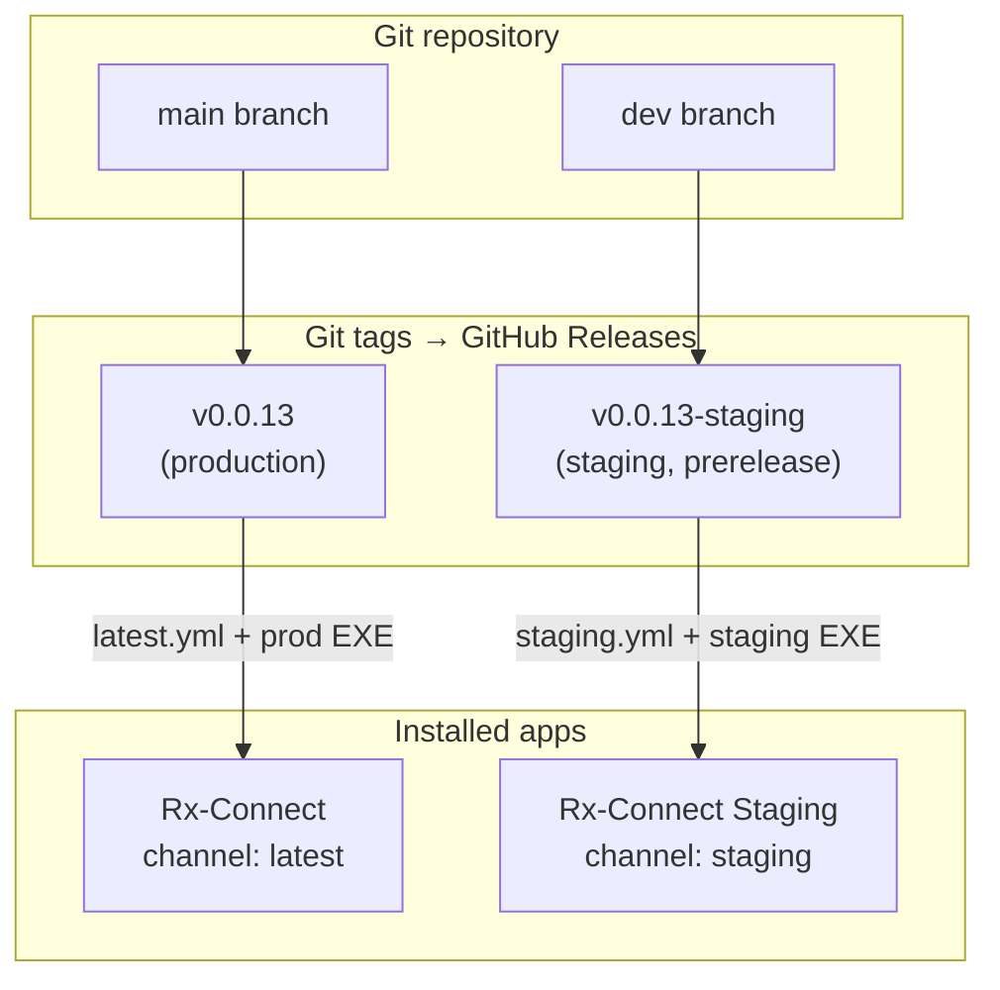
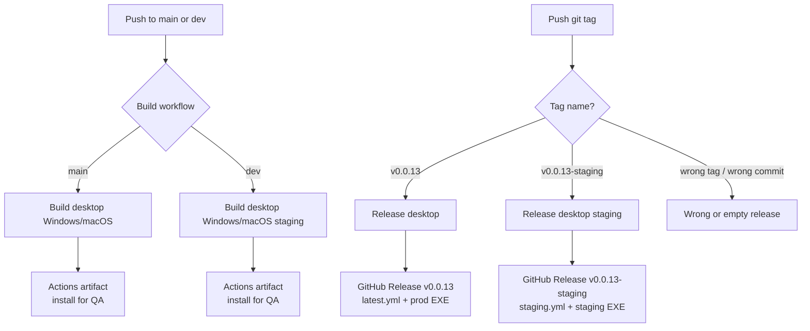
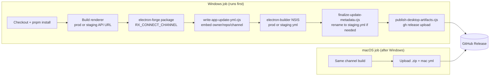
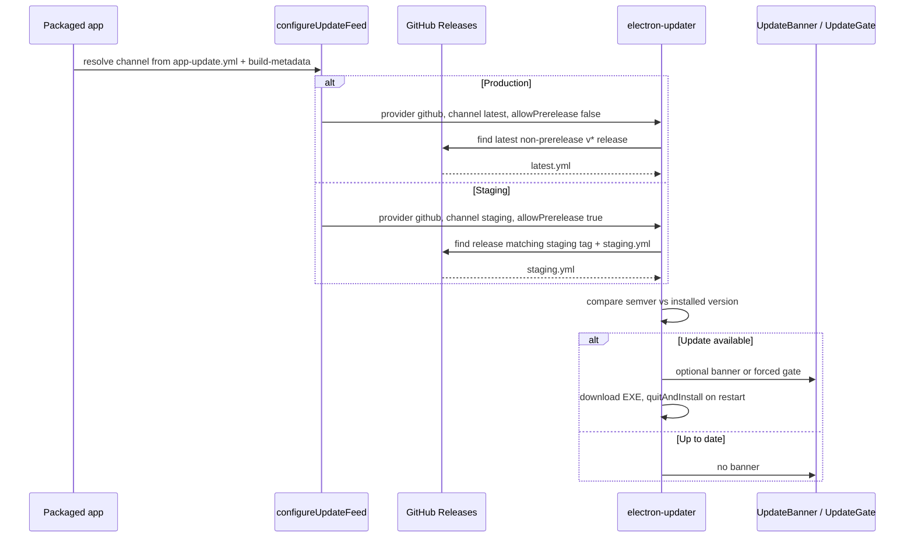
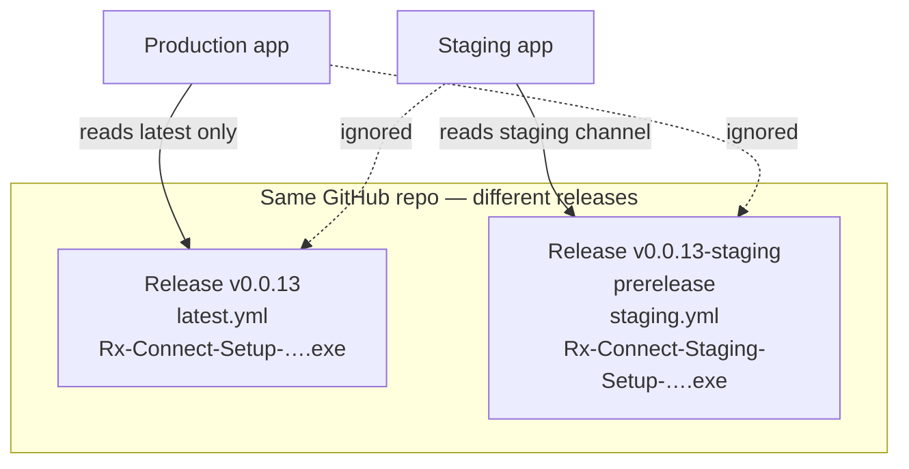

# Rx-Connect desktop auto-update & dual-channel release flow

This document explains how Rx-Connect handles **auto-update**, how **production** and **staging** stay isolated, and how **GitHub Actions workflows** publish installers. It is intended for engineers cutting releases or debugging updater behavior.

**Related docs**

- [apps/desktop/docs/environments.md](../apps/desktop/docs/environments.md) — channel matrix & tag commands
- [apps/desktop/docs/auto-update.md](../apps/desktop/docs/auto-update.md) — in-app UX, signing, troubleshooting

---

## 1. Big picture

Rx-Connect ships as **two separate desktop apps** that can install side-by-side on the same machine:

|                             | Production                      | Staging                                  |
| --------------------------- | ------------------------------- | ---------------------------------------- |
| **App name**                | Rx-Connect                      | Rx-Connect Staging                       |
| **`appId`**                 | `health.onerx.rxconnect`        | `health.onerx.rxconnect.staging`         |
| **API (baked at build)**    | `https://api.onerx.com`         | `https://api.staging.onerx.com`          |
| **Git branch (convention)** | `main`                          | `dev`                                    |
| **Release tag**             | `v0.0.13`                       | `v0.0.13-staging`                        |
| **Updater channel**         | `latest`                        | `staging`                                |
| **Update metadata file**    | `latest.yml` / `latest-mac.yml` | `staging.yml` / `staging-mac.yml`        |
| **GitHub release type**     | Normal release                  | **Prerelease** (prod updater ignores it) |

Build channel is selected at compile time via `RX_CONNECT_CHANNEL=production|staging` (see `apps/desktop/scripts/build-channel.cjs`).



---

## 2. Two kinds of CI workflows

We use **six** desktop workflows. Only **tag pushes** create GitHub Releases that auto-update reads. Branch pushes only **verify the build** and store **Actions artifacts** (for QA installs).

| Workflow                         | Trigger                          | Channel    | Publishes to Releases? |
| -------------------------------- | -------------------------------- | ---------- | ---------------------- |
| Build desktop (Windows)          | Push/PR → `main`                 | Production | No — artifact only     |
| Build desktop (macOS)            | Push/PR → `main`                 | Production | No — artifact only     |
| Build desktop (Windows, staging) | Push/PR → `dev`                  | Staging    | No — artifact only     |
| Build desktop (macOS, staging)   | Push/PR → `dev`                  | Staging    | No — artifact only     |
| **Release desktop**              | Tag `v*` (not staging)           | Production | **Yes**                |
| **Release desktop (staging)**    | Tag `v*-staging` or `staging-v*` | Staging    | **Yes**                |



### Tag rules (important)

GitHub Actions tag filters use **glob patterns**, not regex.

| Tag               | Workflow that must run        | Notes                         |
| ----------------- | ----------------------------- | ----------------------------- |
| `v0.0.13`         | **Release desktop**           | Production only               |
| `v0.0.13-staging` | **Release desktop (staging)** | Preferred staging tag         |
| `staging-v0.0.13` | **Release desktop (staging)** | Legacy; still supported in CI |

**Production workflow guard:** jobs skip when the tag contains `-staging` or starts with `staging-`, so `v0.0.13-staging` never builds prod.

**Staging tag must point at a commit that includes the workflow YAML you expect.** GitHub runs workflows from the **tagged commit**, not from `main` HEAD.

---

## 3. Release publish pipeline (CI)

Both release workflows follow the same build/publish steps; only the channel env and metadata filenames differ.



**Key scripts** (`apps/desktop/scripts/`)

| Script                          | Role                                                                                                                    |
| ------------------------------- | ----------------------------------------------------------------------------------------------------------------------- |
| `build-channel.cjs`             | Single source of truth for appId, API URL, updater channel, artifact names                                              |
| `write-app-update-yml.cjs`      | Writes `resources/app-update.yml` into the packaged app (owner, repo, channel)                                          |
| `finalize-update-metadata.cjs`  | Renames `latest.yml` → `staging.yml` for staging; also copies `staging.yml` → `latest.yml` as electron-updater fallback |
| `publish-desktop-artifacts.cjs` | Creates/updates GitHub Release via `gh release upload` (avoids path issues with spaced artifact names)                  |

**Staging releases** are marked **prerelease** so GitHub’s “Latest release” and production `electron-updater` (channel `latest`, `allowPrerelease: false`) never pick them up.

---

## 4. Runtime auto-update (installed app)

We use [`electron-updater`](https://www.electron.build/auto-update) with **GitHub Releases** as the feed. Update checks run:

1. **On app launch** (before the main window), and
2. **Manually** from **Settings → Desktop App**.



**Where channel is baked in**

| Location                   | Production                            | Staging                      |
| -------------------------- | ------------------------------------- | ---------------------------- |
| `resources/app-update.yml` | no `channel` key (defaults to latest) | `channel: staging`           |
| `build-metadata.json`      | `updateChannel: latest`               | `updateChannel: staging`     |
| Updater cache dir          | `rx-connect-updater`                  | `rx-connect-staging-updater` |

Implementation: `apps/desktop/src/main/update-feed.ts`, `update-service.ts`.

### How dual-channel isolation works

Production and staging must **never** cross-update:

| Mechanism                           | Production         | Staging                   |
| ----------------------------------- | ------------------ | ------------------------- |
| **Separate `appId` / install path** | Yes                | Yes                       |
| **Different metadata file**         | `latest.yml`       | `staging.yml`             |
| **electron-updater channel**        | `latest` (default) | `staging`                 |
| **`allowPrerelease`**               | `false`            | `true`                    |
| **GitHub release**                  | Normal (`v*`)      | Prerelease (`v*-staging`) |



---

## 5. Forced vs optional updates

| Type         | Source                                                        | Behavior                                      |
| ------------ | ------------------------------------------------------------- | --------------------------------------------- |
| **Optional** | Newer version on the channel’s release                        | Banner + “Restart now”; installs on quit      |
| **Forced**   | `update-policy.json` / `update-policy.staging.json` on `main` | Full-screen gate; auto-restart after download |

Policy fetch **fail-open**: if the policy file is unreachable, the app still opens and only optional updates apply.

See [auto-update.md](../apps/desktop/docs/auto-update.md) for UI details and signing requirements.

---

## 6. Release checklist (team)

### Staging (QA / internal)

```bash
git checkout dev
# merge features, bump apps/desktop/package.json version if needed
git push origin dev

git tag v0.0.14-staging
git push origin v0.0.14-staging
```

Wait for **Release desktop (staging)** (not “Release desktop”). Confirm the release page has `staging.yml` and `Rx-Connect-Staging-Setup-….exe`.

### Production (pharmacies)

```bash
git checkout main
git merge dev   # after QA sign-off
git push origin main

git tag v0.0.14
git push origin v0.0.14
```

Wait for **Release desktop**. Confirm `latest.yml` and `Rx-Connect-Setup-….exe`.

**Version rule:** `apps/desktop/package.json` `version` must match the semver in the tag (e.g. `0.0.14` for `v0.0.14` / `v0.0.14-staging`).

---

## 7. Installing for testing

| Goal                | Source                                                                                    |
| ------------------- | ----------------------------------------------------------------------------------------- |
| Quick QA from CI    | Actions → **Build desktop (Windows, staging)** on `dev` → download artifact zip → run EXE |
| QA with auto-update | GitHub **Releases** → `v0.0.x-staging` → staging EXE                                      |
| Production          | GitHub **Releases** → `v0.0.x` → prod EXE                                                 |

Actions artifact zips are **not** the auto-update feed; only **GitHub Releases** drive `electron-updater`.

---

## 8. Common pitfalls

| Symptom                                     | Likely cause                                                                                                   |
| ------------------------------------------- | -------------------------------------------------------------------------------------------------------------- |
| Staging says “up to date” but prod updated  | Staging release missing or wrong tag format; prod and staging tags are independent                             |
| `Cannot find latest.yml` on staging         | Release `v0.0.x-staging` has no assets — **Release desktop (staging)** did not run or tag points at old commit |
| **Release desktop** ran on `v0.0.x-staging` | Tag pushed before CI guard fix, or tag not moved with `git tag -f` after fix                                   |
| Prod updater hits staging release           | Staging release not marked prerelease, or prod built with wrong channel                                        |
| Update check 401 on private repo            | Need `UPDATER_GH_TOKEN` at pack time (not CI `GITHUB_TOKEN`)                                                   |

---

## 9. File reference

| Area                     | Path                                            |
| ------------------------ | ----------------------------------------------- |
| Channel profiles         | `apps/desktop/scripts/build-channel.cjs`        |
| Prod electron-builder    | `apps/desktop/electron-builder.yml`             |
| Staging electron-builder | `apps/desktop/electron-builder.staging.yml`     |
| Updater feed config      | `apps/desktop/src/main/update-feed.ts`          |
| Update service / UX      | `apps/desktop/src/main/update-service.ts`       |
| Prod release workflow    | `.github/workflows/release-desktop.yml`         |
| Staging release workflow | `.github/workflows/release-desktop-staging.yml` |
| Branch build workflows   | `.github/workflows/build-desktop-*.yml`         |
