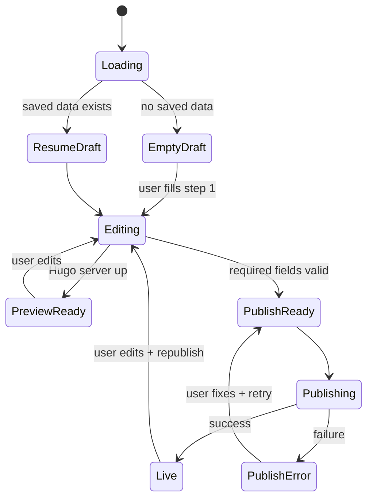

# Website Builder — Production-Grade UX Guide

Detailed guide for delivering a **production-quality** pharmacy website experience in **Rx-Connect** (Electron Forge + Next.js renderer + Hugo + Vercel). Complements [website-builder-rx-connect-vs-medessist.md](./website-builder-rx-connect-vs-medessist.md).

**Audience:** Product, design, and engineering.  
**Goal:** Pharmacy staff with **no technical background** can build, preview, publish, and update a site with confidence — comparable polish to MedEssist, with **faster** self-serve where possible.

---

## 1. UX north star

| Principle                     | What it means in practice                                                                       |
| ----------------------------- | ----------------------------------------------------------------------------------------------- |
| **Never wonder if it worked** | Every action has visible state: saving, building, deploying, live, failed.                      |
| **Preview = truth**           | What you see in preview matches production (same template, same data, staging URL when online). |
| **One stable address**        | Republish updates the same URL; changing Site ID is a deliberate, warned action.                |
| **No secrets for pharmacy**   | Token and DNS complexity live in OneRx ops/API, not on the pharmacy desktop.                    |
| **Recoverable mistakes**      | Clear errors + one primary fix action; publish never spins forever.                             |
| **Progressive disclosure**    | Simple path for MVP launch; advanced (custom domain, SEO) optional.                             |
| **Trust signals**             | Show last saved, last published, link to live site, domain/SSL status.                          |

**MedEssist benchmark (experience, not speed):** pharmacy never touches hosting; advisor guides launch; branded domain “just works.”  
**Rx-Connect target:** match **trust and clarity**, keep **minutes-not-weeks** self-serve.

---

## 2. Who uses this (personas)

| Persona                 | Skill    | Primary job                       | UX priority                                             |
| ----------------------- | -------- | --------------------------------- | ------------------------------------------------------- |
| **Pharmacy owner**      | Low tech | Approve look & URL before go-live | Simple publish, clear live link, custom domain guidance |
| **Pharmacy manager**    | Medium   | Update hours, services, promos    | Fast edit + republish, preview accuracy                 |
| **OneRx ops / support** | High     | Fix failed deploys, DNS, tokens   | Admin dashboard, logs, impersonation (future)           |

Design and copy for **owner + manager**, not developers.

---

## 3. Core user journeys (states every screen must support)

### 3.1 First-time launch



**Required UX elements**

- Skeleton while `WebBuilderLoad` + `WebBuilderInit` run (not blank panel).
- Welcome hint on first visit: “5 steps · auto-saved · preview on the right.”
- Pre-fill pharmacy name from Rx-Connect profile if available.
- **Completion meter** (e.g. “4/5 steps complete”) in header or sidebar.

### 3.2 Edit after live

| User expectation          | System behavior                                                             |
| ------------------------- | --------------------------------------------------------------------------- |
| “My site is already live” | Show **Published** badge + link in header on all steps                      |
| “I changed hours”         | Auto-save + preview refresh; banner: “Changes not public until you publish” |
| “I published again”       | Same URL; toast: “Site updated” (not “new site created”)                    |

### 3.3 Custom domain (pharmacyname.ca)

| State          | UI                                                                 |
| -------------- | ------------------------------------------------------------------ |
| Not configured | Optional field + “Most pharmacies use …” help                      |
| Pending DNS    | Yellow status: “Waiting for DNS” + copyable CNAME + [Check status] |
| Active         | Green: “Domain active” + link                                      |
| Failed         | Red + support link                                                 |

Never leave user on “Deploying…” without timeout (max **60s** with message).

---

## 4. Information architecture (wizard)

**Current steps (keep order):** Info → Theme → Content → Services → Publish.

### 4.1 Step design rules

| Rule                                 | Implementation                                             |
| ------------------------------------ | ---------------------------------------------------------- |
| One primary action per step          | Save is automatic; no extra “Save step” button             |
| Inline validation                    | Show errors on blur or on “Next”, not only on publish      |
| Don’t block Next for optional fields | Warn if hero empty; block only for publish-critical fields |
| Sticky context                       | Header shows pharmacy name + save status + published URL   |

### 4.2 Required fields for **Publish** (recommended)

| Field                        | Step     | Why                |
| ---------------------------- | -------- | ------------------ |
| Pharmacy name                | Info     | Title, header      |
| Phone or email               | Info     | Contact            |
| Address (city/province)      | Info     | Footer, map        |
| Site ID                      | Publish  | Stable URL         |
| At least one service enabled | Services | Homepage not empty |

Validate in renderer **before** IPC publish; show list of missing items with links to steps.

### 4.3 Recommended UI additions (prod)

- [ ] **Step completion checkmarks** in `BuilderStepNav`
- [ ] **“Publish checklist”** panel on Publish step (green/red items)
- [ ] **Unsaved changes** indicator: `Saving…` / `Saved 2:34 PM` / `Save failed — retry`
- [ ] **Discard changes** (with confirm) for accidental edits
- [ ] **View live site** button in header (when `publishedUrl` exists)

---

## 5. Preview experience (production bar)

**Today:** Local Hugo on `127.0.0.1`, iframe in `PreviewPanel`, debounced refresh.

### 5.1 What “prod grade” preview means

| Requirement     | Detail                                                                                          |
| --------------- | ----------------------------------------------------------------------------------------------- |
| **Parity**      | Same Hugo template version as production build (`TEMPLATE_VERSION` sync)                        |
| **Responsive**  | Toggle Desktop / Tablet / Mobile widths in preview chrome                                       |
| **Performance** | Debounce 800ms OK; show “Updating…”; cap concurrent preview requests (you have `previewGenRef`) |
| **Failure**     | Actionable message + **Retry** (you have this); add “Restart preview engine” if Hugo dies       |
| **Deep link**   | Open preview in system browser (you have external link)                                         |

### 5.2 Phase 2: Cloud staging preview (strongly recommended)

Replace-only-localhost for production UX:

|                               | Local (today)                       | Staging URL (target)                                                         |
| ----------------------------- | ----------------------------------- | ---------------------------------------------------------------------------- |
| URL                           | `http://127.0.0.1:1314`             | `https://preview-{siteId}.vercel.app` or `https://{id}.staging.onerx.health` |
| Matches prod CDN              | No                                  | Yes                                                                          |
| Works on all machines         | Firewall/antivirus sometimes blocks | Yes                                                                          |
| Share with owner for approval | No                                  | Yes — send link                                                              |

**Flow:** Save draft → API creates **preview deployment** → iframe loads staging URL.  
**Publish** → promotes same build to production (or rebuild + production deploy).

This is the **single highest-impact** UX upgrade for “prod grade.”

### 5.3 PreviewPanel checklist

- [ ] Device width presets (1280 / 768 / 375)
- [ ] Label: “Preview” vs “Live site” (don’t confuse with published URL)
- [ ] When `publishedUrl` exists, sublabel: “Preview may differ until you publish”
- [ ] Loading overlay on iframe until `onLoad` (avoid flash of stale content)

---

## 6. Publish experience (production bar)

### 6.1 Publish state machine (UI must implement fully)

```
idle → building → deploying → live
                    ↘ error → idle (with message + retry)
```

| Phase       | User sees                                      | Max duration | Backend               |
| ----------- | ---------------------------------------------- | ------------ | --------------------- |
| `building`  | “Building your site…” + indeterminate progress | ~10–30s      | Hugo `--minify`       |
| `deploying` | “Publishing to the web…” + optional %          | ≤60s         | Vercel upload + READY |
| `live`      | Green card + **primary** link + “Copy URL”     | —            | —                     |
| `error`     | Plain-language error + **Retry publish**       | —            | —                     |

**Never:** disable UI with no timeout; never show a new random `*.vercel.app` as the “official” URL when Site ID mode is intended.

### 6.2 Publish progress (recommended UI)

```
┌─────────────────────────────────────────┐
│  Publishing your website                 │
│  ●━━━━○━━━━○  Building · Upload · Live   │
│  Step 2 of 3: Uploading to the web…      │
│  Usually takes under a minute.           │
└─────────────────────────────────────────┘
```

Wire steps to IPC events (split `WebBuilderPublish` into progress callbacks or poll job status from API in Phase 2).

### 6.3 Error messages (copy guide)

| Technical cause         | User-facing message                                                                                                                    |
| ----------------------- | -------------------------------------------------------------------------------------------------------------------------------------- |
| `deploy_not_configured` | “Publishing isn’t set up for this installation. Contact OneRx support.”                                                                |
| Hugo missing            | “Website tools aren’t installed correctly. Reinstall Rx-Connect or contact support.”                                                   |
| Vercel 401/403          | “We couldn’t connect to hosting. Support is fixing account access.”                                                                    |
| Timeout 60s             | “Publishing is taking longer than usual. Try again in a minute or check status in Vercel.”                                             |
| Alias/domain failed     | “Your site was uploaded but the web address couldn’t be updated. Don’t change your Site ID — contact support with code: DOMAIN_ALIAS.” |
| Network offline         | “You’re offline. Connect to the internet to publish.”                                                                                  |

Log technical detail to `electron-log`; show **support code** (short id) in UI for ops.

### 6.4 Success state (live)

Must include:

1. **Primary:** Open live site (canonical URL only)
2. **Copy URL** button
3. **Last published:** timestamp (relative + absolute)
4. If custom domain pending: DNS instructions + status card
5. Short line: “To update your site after edits, click **Publish website** again.”

---

## 7. Domain & URL UX (production bar)

### 7.1 URL modes (explain in UI, not in .env)

| Mode         | Example                             | When to show                       |
| ------------ | ----------------------------------- | ---------------------------------- |
| **Default**  | `https://rx-greenhealth.vercel.app` | No platform domain configured      |
| **Platform** | `https://greenhealth.rxsites.com`   | OneRx owns `rxsites.com` on Vercel |
| **Custom**   | `https://www.pharmacyname.ca`       | User entered custom domain         |

Show **exact** URL before publish: `Live URL will be: https://…`

### 7.2 Site ID rules (prevent accidental new sites)

- **Warn** on change if `publishedUrl` already exists:  
  “Changing Site ID creates a **new** website address. Your current site stays at {old URL}.”
- Require checkbox: “I understand this creates a new address”
- **Recommend:** lock Site ID after first successful publish (unlock via “Advanced”)

### 7.3 Custom domain wizard (MedEssist-like clarity)

Step-by-step inside Publish (or modal):

1. Enter domain → validate format (no `https://`, no path)
2. Publish attaches domain on server
3. Show **exact DNS records** (CNAME target) with copy buttons
4. **[Verify DNS]** button → polls API → updates status chip
5. When verified: “Domain active” + set as primary link

Ops-run mode: same UI, status fed by admin.

---

## 8. Architecture for prod UX (Electron Forge + Next.js)

**Rule:** Production UX requires **server-side publish**. Desktop-only deploy cannot meet security, reliability, or MedEssist-like domain expectations at scale.

### 8.1 Target split of responsibilities

| Layer                | Responsibility                                                |
| -------------------- | ------------------------------------------------------------- |
| **Next.js renderer** | Wizard, validation, preview iframe, publish UI, status        |
| **Electron main**    | IPC, optional offline cache, auth token to API                |
| **OneRx API**        | Save draft, trigger build, deploy, domain verify, return URLs |
| **CI / worker**      | Hugo build (reproducible, not on pharmacy CPU)                |
| **Vercel**           | Host production + preview + SSL                               |

### 8.2 API contract (minimum for prod UX)

```typescript
// Draft
POST / api / v1 / pharmacy - sites / { pharmacyId } / draft; // body: PharmacyWebsiteData
GET / api / v1 / pharmacy - sites / { pharmacyId } / draft;

// Preview
POST / api / v1 / pharmacy - sites / { pharmacyId } / preview; // → { previewUrl, jobId }
GET / api / v1 / pharmacy - sites / jobs / { jobId }; // → { status, previewUrl?, error? }

// Publish
POST / api / v1 / pharmacy - sites / { pharmacyId } / publish; // → { jobId }
GET / api / v1 / pharmacy - sites / jobs / { jobId }; // → { status, liveUrl?, steps[] }

// Domain
POST / api / v1 / pharmacy - sites / { pharmacyId } / domains / verify;
GET / api / v1 / pharmacy - sites / { pharmacyId } / domains / status;
```

Electron calls these with **user JWT** — not `VERCEL_API_TOKEN`.

### 8.3 Renderer patterns (Next.js in Electron)

| Pattern                | Use                                                                      |
| ---------------------- | ------------------------------------------------------------------------ |
| **React Query / SWR**  | Poll `jobId` during publish; show real steps                             |
| **Optimistic save**    | Update UI immediately; rollback on API error                             |
| **Zustand or context** | `siteDraft`, `publishJob`, `deploySettings`                              |
| **Shared types**       | `@rx-manager/shared` — already has `PharmacyWebsiteData`                 |
| **toasts**             | Success/error (you use `sonner`) — add persistent banner for DNS pending |

### 8.4 IPC evolution

| Today                                 | Prod                                                                  |
| ------------------------------------- | --------------------------------------------------------------------- |
| `WebBuilderPublish` blocks until done | `WebBuilderPublishStart` → returns `jobId`; events `publish:progress` |
| `WebBuilderSave` → local store        | Save → API + local cache                                              |
| `WebBuilderDeployConfigured`          | `GET /capabilities` → `{ publish: true, platformDomain, features }`   |

Keep IPC thin: main process proxies API with auth headers from session.

---

## 9. Integrations UX (patient-facing quality)

MedEssist feels “integrated” because refill/booking are **native**, not a raw URL field.

| Integration | MVP (today)             | Prod                                        |
| ----------- | ----------------------- | ------------------------------------------- |
| Booking     | `bookingEmbedUrl` paste | OneRx booking widget + pharmacy id          |
| Refills     | Link out                | Patient portal deep link / embed            |
| Map         | Google Maps embed URL   | Validated embed + fallback static map image |
| Phone       | Click-to-call `tel:`    | Same + formatted display                    |

**UX:** In wizard, label as “Connect patient services” with toggles, not “Embed URL (optional).”

---

## 10. Non-functional requirements (prod)

| Area                     | Target                                               |
| ------------------------ | ---------------------------------------------------- |
| **Publish success rate** | ≥99% (excluding user network)                        |
| **Publish p95 time**     | <90s end-to-end                                      |
| **Preview refresh p95**  | <3s after edit stop                                  |
| **Auto-save**            | Every change within 2s debounce; visible status      |
| **Offline**              | Edit draft offline; block publish with clear message |
| **Accessibility**        | WCAG 2.1 AA for wizard (labels, focus, contrast)     |
| **Localization**         | EN-CA first; FR-CA for Quebec pharmacy (future)      |

---

## 11. Security & trust (user-visible)

| Concern             | Prod behavior                                          |
| ------------------- | ------------------------------------------------------ |
| Token on laptop     | Remove from pharmacy builds                            |
| HTTPS only          | All public URLs `https://`                             |
| PHI in site content | Warn: “Don’t put patient information on public pages”  |
| Content Security    | Static site; no arbitrary script injection from wizard |

---

## 12. Prioritized implementation roadmap (UX-first)

### P0 — Must ship for credible prod (4–6 weeks)

| #   | Item                                                            | UX outcome                    |
| --- | --------------------------------------------------------------- | ----------------------------- |
| 1   | Publish timeout + error states + retry                          | No infinite “Deploying…”      |
| 2   | Pre-publish validation checklist                                | Fewer failed publishes        |
| 3   | Stable URL messaging + Site ID change warning                   | No accidental duplicate sites |
| 4   | Header: saved time + published link + “changes not live” banner | Trust                         |
| 5   | Human-readable errors + support codes                           | Supportable                   |
| 6   | Move `VERCEL_API_TOKEN` to **backend publish API**              | Pharmacy zero-config          |

### P1 — Feels professional (6–10 weeks)

| #   | Item                                     | UX outcome                 |
| --- | ---------------------------------------- | -------------------------- |
| 7   | Cloud **staging preview** URL in iframe  | Preview = production       |
| 8   | Publish job polling + step progress UI   | Transparency               |
| 9   | Custom domain DNS wizard + verify button | MedEssist-like domain flow |
| 10  | Responsive preview widths                | Mobile confidence          |
| 11  | Step completion indicators               | Orientation                |

### P2 — Competitive with MedEssist (3–6 months)

| #   | Item                                      | UX outcome              |
| --- | ----------------------------------------- | ----------------------- |
| 12  | OneRx booking/refill widgets              | Integrated storefront   |
| 13  | Web admin (same wizard in browser)        | Access without Electron |
| 14  | Platform domain `*.rxsites.com` automated | Branded URLs            |
| 15  | “Request managed launch” tier             | White-glove option      |

### P3 — Polish

| #   | Item                             |
| --- | -------------------------------- |
| 16  | FR-CA                            |
| 17  | Version history / rollback       |
| 18  | A/B or analytics snippet in site |
| 19  | SEO score hints in wizard        |

---

## 13. Acceptance criteria (QA checklist)

Before calling Website Builder **production-ready**:

### Onboarding

- [ ] First launch shows guidance; returning user sees previous draft
- [ ] Preview loads within 30s on clean install

### Editing

- [ ] Auto-save visible; killing app restores draft
- [ ] Every step reachable via nav; Back/Next work
- [ ] Theme change reflects in preview

### Publish

- [ ] Valid site publishes to expected URL format
- [ ] Republish updates same URL (same Site ID)
- [ ] Publish fails gracefully at 60s with retry
- [ ] Success screen opens correct URL in browser

### Domain

- [ ] Custom domain shows DNS instructions after publish
- [ ] Site ID change shows warning if already published

### Edge cases

- [ ] No network → publish blocked with clear message
- [ ] Invalid token (ops) → support message, not stack trace
- [ ] Hugo binary missing → clear install message

### Non-Electron

- [ ] Browser-only visit shows “use desktop app” (you have this)

---

## 14. Metrics to track

| Metric                     | Why                    |
| -------------------------- | ---------------------- |
| Time to first publish      | Onboarding friction    |
| Publish failure rate       | Reliability            |
| Republish rate             | Active use             |
| % sites with custom domain | Domain UX success      |
| Support tickets / publish  | Copy and error quality |
| Preview error rate         | Hugo/local health      |
| Wizard drop-off by step    | IA improvements        |

---

## 15. File map (where to implement)

| UX area       | Files today                                                                                                           |
| ------------- | --------------------------------------------------------------------------------------------------------------------- |
| Wizard shell  | `WebsiteBuilderView.tsx`                                                                                              |
| Steps         | `StepPharmacyInfo.tsx`, `StepThemeSelector.tsx`, `StepContentEditor.tsx`, `StepServicesEditor.tsx`, `StepPublish.tsx` |
| Preview       | `PreviewPanel.tsx`                                                                                                    |
| IPC           | `website-builder.ts` (handlers), `website-builder.ts` (renderer lib)                                                  |
| Build/preview | `hugo-service.ts`                                                                                                     |
| Deploy        | `deploy-service.ts` → migrate to API                                                                                  |
| Types         | `packages/shared/src/types/website-builder.ts`                                                                        |

---

## 16. Summary: best path to prod-grade UX

1. **Treat publish as a job**, not a blocking IPC call — progress, timeout, retry.
2. **Move deploy + secrets to OneRx API** — pharmacy never configures Vercel.
3. **Cloud staging preview** — biggest gap vs MedEssist’s hosted preview.
4. **Guided domain wizard** — DNS verify loop, not a paragraph of CNAME text.
5. **Guard Site ID** — same URL on republish; warn on change.
6. **Validate before publish** — checklist, not surprise failures.
7. **Integrate patient flows** — widgets, not raw URLs.
8. **Measure** — publish success, time-to-live, step drop-off.

**Stack choice (unchanged):** Electron Forge + Next.js for editor; Hugo + Vercel for sites; **new** OneRx API for orchestration. Do not rewrite to WordPress for UX — rewrite the **orchestration and feedback loops**.

---

## Related docs

- [website-builder-rx-connect-vs-medessist.md](./website-builder-rx-connect-vs-medessist.md) — comparison, flows, MedEssist parity architecture (§12)
- `.env.example` — deploy configuration (ops only, not pharmacy)
