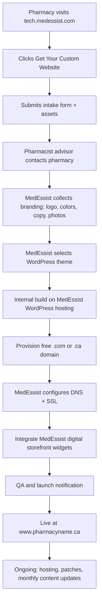
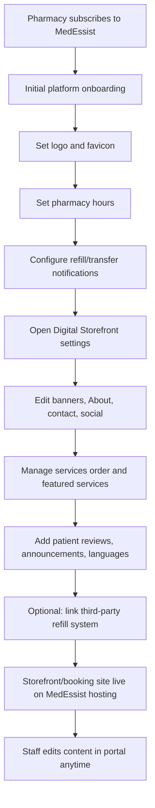
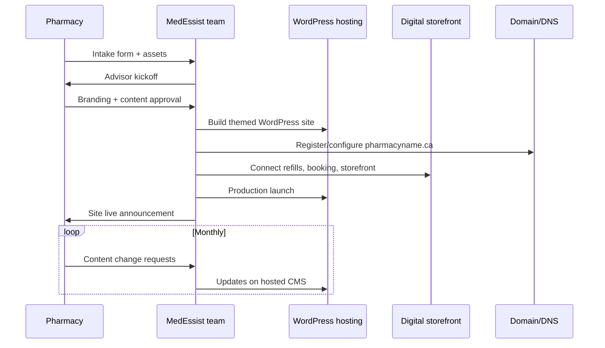
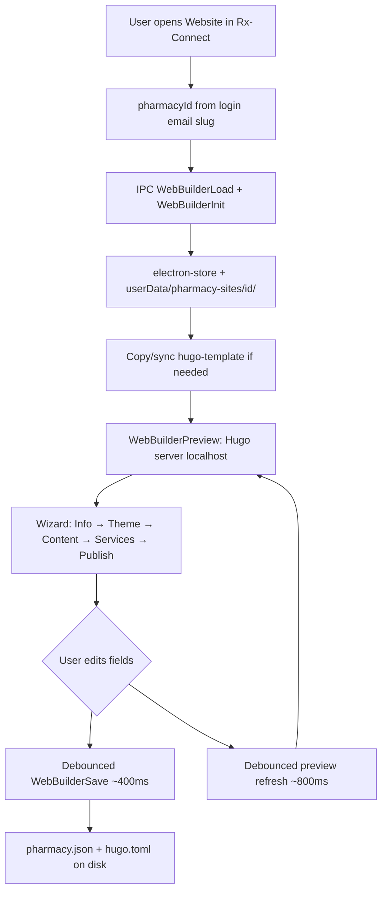
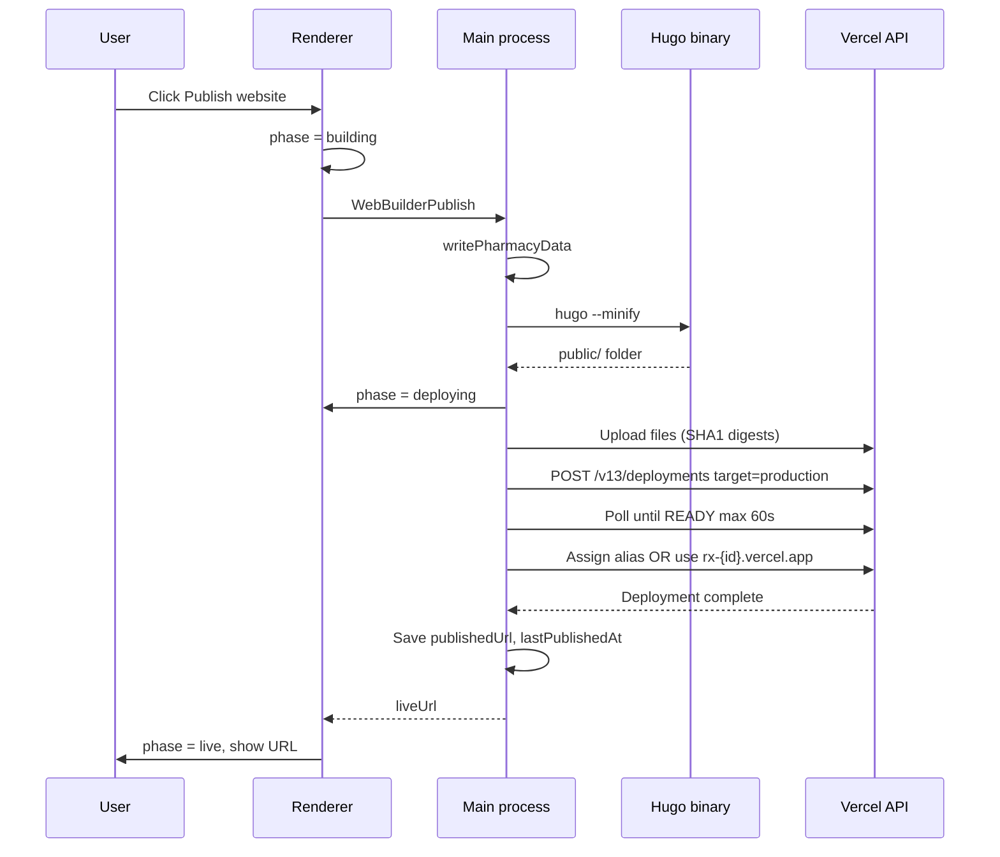
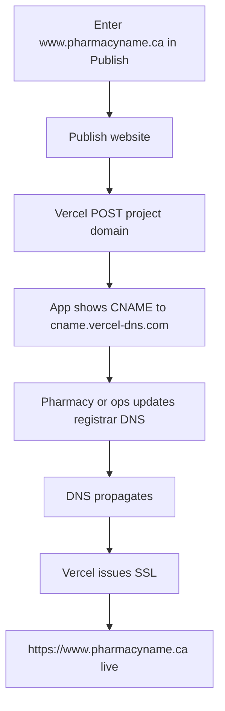
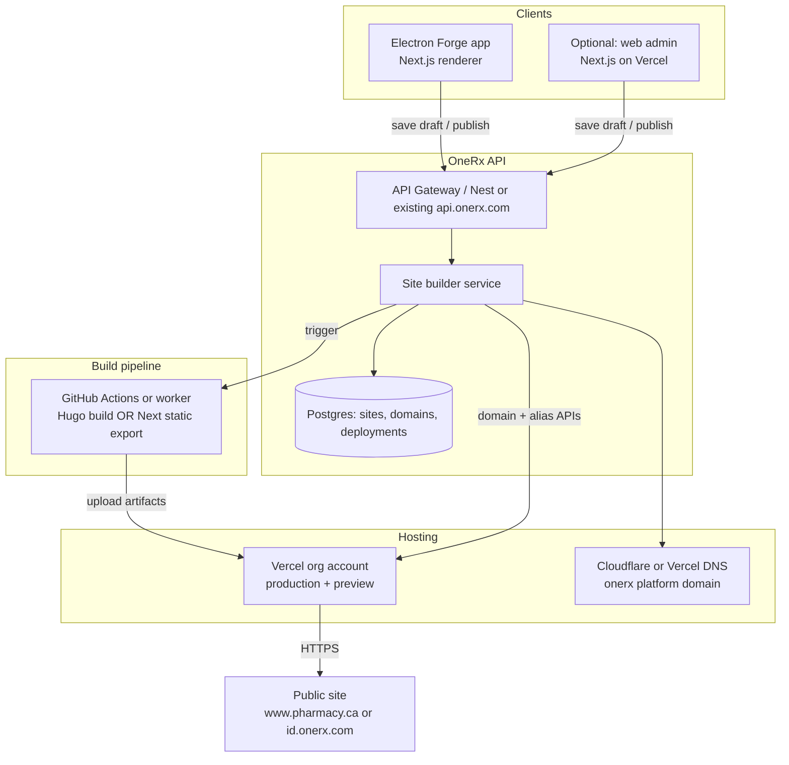
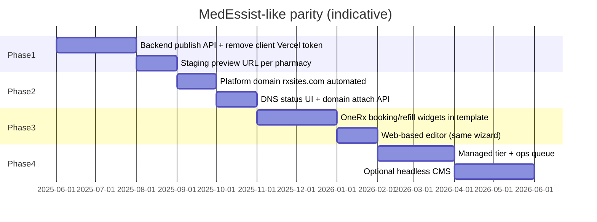

# Website Builder: RX-Connect vs MedEssist

In-depth comparison of how pharmacy website creation, hosting, deployment, and domains work in **RX-Connect** (this repository) versus **MedEssist Web Services** (managed product). Reference sites: MedEssist-style pharmacy sites such as [1230pharmacy.ca](https://1230pharmacy.ca/); RX-Connect implementation lives under `apps/desktop` and `packages/shared`.

---

## 1. Executive summary

| Dimension                   | **MedEssist**                                       | **RX-Connect (this app)**                                       |
| --------------------------- | --------------------------------------------------- | --------------------------------------------------------------- |
| **Model**                   | Fully managed B2B service                           | Self-serve tool inside Electron desktop app                     |
| **Who builds the site**     | MedEssist team (after intake form)                  | Pharmacy staff / operator in-app wizard                         |
| **Time to first live site** | ~2–3 weeks (typical)                                | Minutes (build + Vercel upload)                                 |
| **Primary site engine**     | WordPress (hosted by MedEssist)                     | Hugo static site generator (bundled binary)                     |
| **Hosting**                 | MedEssist infrastructure                            | Vercel (via API token in `.env`)                                |
| **Default public URL**      | Branded custom domain (e.g. `pharmacyname.ca`)      | `https://rx-{site-id}.vercel.app` (no OneRx domain required)    |
| **Custom domain**           | Included (`.com` / `.ca`); MedEssist configures DNS | Optional; pharmacy/registrar adds CNAME to Vercel               |
| **Republish / updates**     | MedEssist (monthly content updates in plan)         | User clicks **Publish website** again (same Site ID → same URL) |
| **Platform integration**    | Deep (refills, appointments, storefront, Google)    | Embeds + links (maps, booking URLs); no MedEssist backend       |
| **Cost to pharmacy**        | ~$39/mo + setup (MedEssist pricing)                 | Vercel usage + optional domain purchase (ops-controlled)        |

---

## 2. End-to-end flows (MedEssist vs RX-Connect)

MedEssist effectively has **two related surfaces** for “being on the web.” RX-Connect combines both roles (build + publish) into one desktop wizard.

| Surface                          | What it is                                                   | Who drives it                              |
| -------------------------------- | ------------------------------------------------------------ | ------------------------------------------ |
| **MedEssist Custom Website**     | Standalone WordPress site product ($39/mo + setup)           | MedEssist team (after intake form)         |
| **MedEssist Digital Storefront** | Booking/patient-facing site settings inside MedEssist portal | Pharmacy staff (self-serve in cloud UI)    |
| **RX-Connect Website Builder**   | Hugo site + Vercel publish inside Electron                   | Pharmacy staff (self-serve in desktop app) |

---

### 2.1 MedEssist — Flow A: Custom Pharmacy Website (WordPress)

**Source:** [Custom pharmacy website](https://tech.medessist.com/custom-pharmacy-website/), public FAQ and “How does it work?”

This is the **managed website product** closest to a marketing site like [1230pharmacy.ca](https://1230pharmacy.ca/).



| Step | Actor     | Action                                                                                     | Typical duration |
| ---- | --------- | ------------------------------------------------------------------------------------------ | ---------------- |
| 1    | Pharmacy  | Discovers “Custom Pharmacy Website” offering                                               | —                |
| 2    | Pharmacy  | Fills **short intake form** (linked from marketing page)                                   | Minutes          |
| 3    | MedEssist | **Pharmacist advisor** outreach                                                            | Days             |
| 4    | Pharmacy  | Sends **required assets** (branding, content, services copy)                               | Days–weeks       |
| 5    | MedEssist | Picks theme (**Care Classic**, **Serene Health**, **Vital Bold**, etc.)                    | Internal         |
| 6    | MedEssist | Builds/customizes **WordPress** site on **their servers**                                  | Internal         |
| 7    | MedEssist | Registers/configures **free custom domain**                                                | Internal         |
| 8    | MedEssist | **DNS + SSL** + hosting go-live                                                            | Internal         |
| 9    | MedEssist | Wires **refill / appointment / storefront** integration (best with MedEssist subscription) | Internal         |
| 10   | Pharmacy  | Receives **launch**; site is public on branded domain                                      | —                |
| 11   | MedEssist | **Monthly content updates**, security, monitoring (plan inclusion)                         | Ongoing          |

**Pharmacy-visible states:** Waiting on advisor → In build → Launched (no real-time preview or self-publish in this product line).

**Alternate entry paths (same flow, different starting content):**

- **Migrate existing site** (Wix, Squarespace, GoDaddy): MedEssist imports key pages/branding, rebuilds on WordPress.
- **Website only, no MedEssist subscription:** Allowed, but refill/appointment/Reserve with Google integrations are limited.
- **Design-only on third-party platform:** One-time design fee; MedEssist does not host (different flow).

**Timeline:** **2–3 weeks** after intake + assets received (per MedEssist FAQ).

---

### 2.2 MedEssist — Flow B: Digital Storefront (platform UI)

**Source:** [Pharmacy setup guide](https://help.medessist.com/set-up-guide), [Digital storefront help](https://help.medessist.com/digital-storefront)

This is **not** the same as the standalone WordPress website project, but it is how many MedEssist customers **self-serve** web-facing settings after subscribing to the platform.



| Step | Actor     | Action                                                                    |
| ---- | --------- | ------------------------------------------------------------------------- |
| 1    | Pharmacy  | Signs up for **MedEssist platform** (Essential / Professional, etc.)      |
| 2    | Pharmacy  | Completes **initial setup**: logo/colors, hours, notifications            |
| 3    | Pharmacy  | Uses **Digital Storefront** admin for ongoing content                     |
| 4    | Pharmacy  | Updates banners, About Us, contact, social, announcements                 |
| 5    | Pharmacy  | Reorders services, featured services, holiday hours, reviews              |
| 6    | MedEssist | Hosts and serves the **patient-facing storefront** (not built locally)    |
| 7    | Pharmacy  | Optional: **third-party refill** link instead of native MedEssist refills |

**Relationship to Flow A:** Custom Website FAQ states the $39/mo plan includes **“seamless integration of your MedEssist digital storefront.”** In practice, Flow A (WordPress marketing site) + Flow B (storefront/booking backend) are **merged at launch** by MedEssist ops—not by the pharmacy clicking “Publish.”

---

### 2.3 MedEssist — Combined journey (typical “full” customer)



---

### 2.4 RX-Connect — Flow: First visit & editing

**Entry:** Shell → **Website** → `WebsiteBuilderView` (`/website-builder/`)

**Prerequisites (ops, once per environment):**

- `VERCEL_API_TOKEN` in repo-root `.env`
- Hugo binaries vendored under `apps/desktop/resources/bin/`
- App restarted after `.env` changes



| Step | Layer          | What happens                                                                                                            |
| ---- | -------------- | ----------------------------------------------------------------------------------------------------------------------- |
| 1    | Renderer       | `WebsiteBuilderView` mounts; `pharmacyId` = slugified user email                                                        |
| 2    | IPC            | `WebBuilderLoad` → read `websiteBuilder[pharmacyId]` from **electron-store**                                            |
| 3    | IPC            | `WebBuilderInit` → `initPharmacySite`: copy template to `~/Library/Application Support/Rx-Connect/pharmacy-sites/{id}/` |
| 4    | Main           | `syncTemplateToSite` if `TEMPLATE_VERSION` bumped (layouts, themes, content, static)                                    |
| 5    | IPC            | `WebBuilderDeployConfigured` → token present?, URL mode (vercel.app vs platform domain)                                 |
| 6    | IPC            | `WebBuilderPreview` → `writePharmacyData` → spawn **Hugo server** on `127.0.0.1:1313–1320`                              |
| 7    | Renderer       | `PreviewPanel` iframe loads preview URL with cache-bust `?t=`                                                           |
| 8    | User           | Steps through **Pharmacy info**, **Theme** (7 themes), **Content**, **Services**                                        |
| 9    | On each change | `WebBuilderSave` + schedule preview (debounced)                                                                         |
| 10   | Main           | `writePharmacyData`: `data/pharmacy.json`, full `hugo.toml` (theme, menu, baseURL)                                      |

**Wizard steps (code):**

| Step ID    | UI component         | Data touched                                      |
| ---------- | -------------------- | ------------------------------------------------- |
| `info`     | `StepPharmacyInfo`   | Name, contact, address, hours                     |
| `theme`    | `StepThemeSelector`  | `theme`, `primaryColor`, `accentColor`            |
| `content`  | `StepContentEditor`  | Hero, about, gallery, testimonials, licenses, SEO |
| `services` | `StepServicesEditor` | `services[]`                                      |
| `publish`  | `StepPublish`        | Site ID, custom domain, publish button            |

---

### 2.5 RX-Connect — Flow: Publish (go live)



| Step | Component               | Action                                                       |
| ---- | ----------------------- | ------------------------------------------------------------ |
| 1    | `WebsiteBuilderView`    | Validates **Site ID**; sets phase `building` → `deploying`   |
| 2    | IPC `WebBuilderPublish` | Merge `subdomain`, `customDomain` into data                  |
| 3    | `hugo-service`          | `writePharmacyData` with production `baseURL`                |
| 4    | `hugo-service`          | `buildSite` → `hugo --minify` → `{sitePath}/public/`         |
| 5    | `deploy-service`        | Walk files, upload to Vercel `/v2/files`                     |
| 6    | `deploy-service`        | Create deployment `name: rx-{site-id}`, `target: production` |
| 7    | `deploy-service`        | Wait **READY** (≤60s); assign production URL                 |
| 8    | `deploy-service`        | **Default URL:** `https://rx-{site-id}.vercel.app`           |
| 9    | `deploy-service`        | **Optional:** attach `customDomain` → CNAME instructions     |
| 10   | Handler                 | Persist `publishedUrl`, `lastPublishedAt` in electron-store  |
| 11   | Renderer                | Show **Your site is live** + link                            |

**Failure / stuck prevention:**

- Missing token → `deploy_not_configured` (immediate)
- Deploy wait >60s → timeout error (UI leaves “deploying”)
- Platform domain without owning zone → avoided when `SITE_USE_PLATFORM_DOMAIN` is not set

---

### 2.6 RX-Connect — Flow: Republish after changes

```mermaid
flowchart LR
  A[Edit any wizard step] --> B[Auto-save + local preview]
  B --> C[Go to Publish step]
  C --> D{Same Site ID?}
  D -->|Yes| E[Publish website]
  E --> F[Same Vercel project rx-{id}]
  F --> G[New deployment replaces production]
  G --> H[Same URL updated content]
  D -->|No| I[New Vercel project + new URL]
```

| Rule                       | Behavior                                                                   |
| -------------------------- | -------------------------------------------------------------------------- |
| Keep **Site ID** unchanged | Same `https://rx-{site-id}.vercel.app`                                     |
| Change Site ID             | New Vercel project name → **new URL** (old URL may still show old content) |
| Custom domain              | Stays mapped to project; republish updates content behind same domain      |
| Local preview              | Updates immediately; **public site** updates only after **Publish**        |

---

### 2.7 RX-Connect — Flow: Custom domain (pharmacyname.ca)



MedEssist performs steps **C–G internally** during Flow A. RX-Connect exposes **D** to the operator and requires registrar access.

---

### 2.8 Flow comparison table

| Stage              | **MedEssist (Custom Website)**    | **MedEssist (Digital Storefront)**    | **RX-Connect**                       |
| ------------------ | --------------------------------- | ------------------------------------- | ------------------------------------ |
| **Start**          | Marketing intake form             | Platform subscription                 | Open Website in desktop app          |
| **Who builds**     | MedEssist team                    | Pharmacy in cloud portal              | Pharmacy in desktop wizard           |
| **Preview**        | Not self-serve (staging internal) | MedEssist-hosted preview URL          | Localhost Hugo iframe                |
| **CMS / source**   | WordPress                         | MedEssist storefront DB/UI            | `pharmacy.json` + Hugo template      |
| **First go-live**  | 2–3 weeks                         | Days (initial setup)                  | Minutes                              |
| **Publish action** | MedEssist ops launch              | Saves in portal (hosted by MedEssist) | **Publish website** → Vercel API     |
| **Default URL**    | `www.pharmacy.ca` (included)      | MedEssist-hosted storefront URL       | `rx-{site-id}.vercel.app`            |
| **Custom domain**  | Included + managed                | Typically bundled with platform       | Optional CNAME by pharmacy           |
| **Updates**        | Request / monthly included        | Self-serve portal edits               | Edit + **Publish** again             |
| **Integration**    | Native MedEssist                  | Native                                | Embed URLs only (maps, booking link) |

---

### 2.9 Who does what (swimlane summary)

```
MEDESSIST CUSTOM WEBSITE          │  RX-CONNECT WEBSITE BUILDER
──────────────────────────────────┼──────────────────────────────────
Pharmacy: form + assets           │  Pharmacy: wizard + preview
MedEssist: design, WP, DNS        │  OneRx ops: Vercel token, .env
MedEssist: launch                 │  Pharmacy: Publish click
MedEssist: monthly updates        │  Pharmacy: republish when ready
```

---

## 3. Architecture

### MedEssist (inferred from public product description)

```
Pharmacy → Intake / CRM → MedEssist ops
                              │
                              ▼
                    WordPress (theme + plugins)
                              │
                              ▼
              MedEssist-managed hosting + CDN + SSL
                              │
                              ▼
              Custom domain (e.g. www.1230pharmacy.ca)
                              │
                              ▼
              MedEssist app integrations (refill, booking, …)
```

- Centralized multi-tenant or per-customer WordPress instances (exact topology not public).
- No client-side site generator in the pharmacy’s desktop app.
- DNS and certificates managed by MedEssist.

### RX-Connect

```
┌─────────────────────────────────────────────────────────────┐
│  Electron app (Rx-Connect)                                   │
│  ┌──────────────────────┐    IPC     ┌─────────────────────┐ │
│  │ Renderer (Next.js)   │ ◄────────► │ Main process        │ │
│  │ WebsiteBuilderView   │            │ HugoService         │ │
│  │ Step* + PreviewPanel │            │ DeployService       │ │
│  └──────────────────────┘            │ electron-store      │ │
│                                       └──────────┬──────────┘ │
└──────────────────────────────────────────────────┼──────────┘
                                                   │
         Preview: Hugo server (localhost)          │ Publish: HTTPS
         Build: hugo → public/                    ▼
         Site files: userData/pharmacy-sites/     Vercel REST API
                                                   │
                                                   ▼
                                         https://rx-{site-id}.vercel.app
                                         (+ optional custom domain)
```

**Key paths (RX-Connect)**

| Layer         | Location                                                                                       |
| ------------- | ---------------------------------------------------------------------------------------------- |
| UI wizard     | `apps/desktop/src/renderer/components/features/website-builder/`                               |
| Route         | `apps/desktop/src/renderer/app/(dashboard)/website-builder/page.tsx`                           |
| IPC API       | `packages/shared/src/ipc-channels.ts`, `apps/desktop/src/main/ipc/handlers/website-builder.ts` |
| Hugo engine   | `apps/desktop/src/main/services/hugo-service.ts`                                               |
| Deploy        | `apps/desktop/src/main/services/deploy-service.ts`                                             |
| Template      | `apps/desktop/resources/hugo-template/`                                                        |
| Hugo binaries | `apps/desktop/resources/bin/{darwin,darwin-x64,win32,linux}/`                                  |
| Shared types  | `packages/shared/src/types/website-builder.ts`                                                 |

---

## 4. Stack comparison

| Layer               | **MedEssist**                                               | **RX-Connect**                                                                                                                            |
| ------------------- | ----------------------------------------------------------- | ----------------------------------------------------------------------------------------------------------------------------------------- |
| **Client**          | Web / MedEssist platform (not a local builder)              | **Electron** desktop + **Next.js 14** renderer                                                                                            |
| **Site generator**  | **WordPress** (PHP, themes, plugins)                        | **Hugo** v0.139.x (Go binary, static output)                                                                                              |
| **Templating**      | WordPress PHP themes                                        | Hugo layouts + partials (`layouts/`, `themes/`)                                                                                           |
| **Styling**         | Theme-specific (Care Classic, Serene Health, Vital Bold, …) | **7 themes** (CSS variants on shared layouts): trust-blue, nature-green, care-violet, vital-orange, modern-slate, fresh-teal, classic-red |
| **CSS framework**   | Theme-dependent                                             | **Bootstrap 5** vendored under `static/vendor/`                                                                                           |
| **Content model**   | WP posts/pages + MedEssist widgets                          | `PharmacyWebsiteData` → `data/pharmacy.yaml` + generated `hugo.toml`                                                                      |
| **Preview**         | Staging URL from MedEssist                                  | Local **Hugo server** in iframe (`PreviewPanel`, CSP allows `127.0.0.1`)                                                                  |
| **Persistence**     | MedEssist cloud / CMS                                       | **electron-store** (`websiteBuilder` bucket) + per-pharmacy folder under `userData/pharmacy-sites/{pharmacyId}/`                          |
| **Hosting**         | MedEssist servers                                           | **Vercel** (static file deployment API)                                                                                                   |
| **Auth for deploy** | N/A (customer never deploys)                                | `VERCEL_API_TOKEN` in repo-root `.env` (loaded via `load-env.cjs` / `load-env.ts`)                                                        |
| **API surface**     | MedEssist backend services                                  | Direct `https://api.vercel.com` from main process (no separate RX-Connect backend for publish)                                            |

### Why static Hugo vs WordPress (design tradeoff)

|                      | **WordPress (MedEssist)**        | **Hugo (RX-Connect)**                                                    |
| -------------------- | -------------------------------- | ------------------------------------------------------------------------ |
| **Runtime**          | Server-side PHP + DB             | Pre-built HTML/CSS/JS only                                               |
| **Security surface** | Larger (WP core, plugins, admin) | Smaller (static files on CDN)                                            |
| **Dynamic features** | Native (forms, plugins, CMS UI)  | Mostly static; dynamic bits via embeds (Google Maps iframe, booking URL) |
| **Build location**   | On server / MedEssist pipeline   | On pharmacy machine (Electron main)                                      |
| **Suitability**      | Rich CMS, non-technical editors  | Fast, repeatable pharmacy microsites from structured data                |

---

## 5. Deployment comparison

### MedEssist

| Aspect              | Behavior                                                              |
| ------------------- | --------------------------------------------------------------------- |
| **Trigger**         | MedEssist ops after QA                                                |
| **Pipeline**        | Internal (WordPress deploy to their hosting); not exposed to pharmacy |
| **Environments**    | Staging → production (typical managed flow; details proprietary)      |
| **Rollback**        | Handled by MedEssist support                                          |
| **Customer action** | None                                                                  |

### RX-Connect

| Aspect             | Behavior                                                                                                                                |
| ------------------ | --------------------------------------------------------------------------------------------------------------------------------------- |
| **Trigger**        | User clicks **Publish website** in `StepPublish` → IPC `WebBuilderPublish`                                                              |
| **Steps**          | 1) `initPharmacySite` 2) `writePharmacyData` 3) `buildSite` (`hugo` → `public/`) 4) `deploySite`                                        |
| **Upload**         | Walk `public/`, SHA1 digests, POST files to Vercel `/v2/files`, POST `/v13/deployments` with `target: "production"`                     |
| **Project naming** | Default: `rx-{site-id}` (one Vercel project per site ID). Optional shared `VERCEL_PROJECT_NAME` when platform subdomain mode is enabled |
| **Ready wait**     | Poll deployment until `READY` (max **60s**); 30s per-request fetch timeout                                                              |
| **Republish**      | New deployment to **same** Vercel project name → production URL updates; **Site ID must stay the same**                                 |
| **Failure modes**  | Missing token → `deploy_not_configured`; invalid platform domain → alias errors / timeout (fixed by defaulting to `.vercel.app` mode)   |

**Environment variables (RX-Connect deploy)**

| Variable                   | Required                     | Purpose                                      |
| -------------------------- | ---------------------------- | -------------------------------------------- |
| `VERCEL_API_TOKEN`         | Yes (for publish)            | Bearer token for Vercel API                  |
| `VERCEL_TEAM_ID`           | If using team token          | `x-vercel-team-id` header                    |
| `SITE_BASE_DOMAIN`         | Only for platform subdomains | e.g. `rxsites.com` (must be owned on Vercel) |
| `SITE_USE_PLATFORM_DOMAIN` | With base domain             | `true` → `{site-id}.{SITE_BASE_DOMAIN}`      |
| `VERCEL_PROJECT_NAME`      | Optional                     | Shared project when in platform mode         |

**Security note:** The Vercel token lives in the **desktop app process**. Suitable for internal/controlled builds. Production-wide pharmacy distribution usually needs a **backend deploy proxy** so tokens are not on every client.

---

## 6. Domain & URL comparison

### MedEssist

| URL type                       | How it works                                                         |
| ------------------------------ | -------------------------------------------------------------------- |
| **Primary**                    | **Custom branded domain** included (e.g. `1230pharmacy.ca`, `www.…`) |
| **Provisioning**               | MedEssist registers/configures domain and DNS                        |
| **SSL**                        | Managed by MedEssist                                                 |
| **Subdomain on medessist.com** | Not the marketed model; public sites are pharmacy-branded            |
| **Timeline**                   | Part of 2–3 week setup                                               |

### RX-Connect

Three modes (documented in Publish UI and `deploy-service.ts`):

#### Mode A — Default (current; no OneRx domain needed)

| Item            | Detail                                                                 |
| --------------- | ---------------------------------------------------------------------- |
| **URL pattern** | `https://rx-{site-id}.vercel.app`                                      |
| **Example**     | Site ID `greenhealth` → `https://rx-greenhealth.vercel.app`            |
| **DNS**         | Vercel-managed `*.vercel.app`                                          |
| **Republish**   | Same site ID → same hostname, new deployment                           |
| **Config**      | Leave `SITE_BASE_DOMAIN` empty; `SITE_USE_PLATFORM_DOMAIN` unset/false |

#### Mode B — Custom pharmacy domain (MedEssist-like branding)

| Item                | Detail                                                                                            |
| ------------------- | ------------------------------------------------------------------------------------------------- |
| **URL pattern**     | `https://www.yourpharmacy.ca` (user-entered)                                                      |
| **Flow**            | Publish attaches domain to Vercel project → user/pharmacy adds **CNAME** → `cname.vercel-dns.com` |
| **SSL**             | Vercel after DNS verification                                                                     |
| **Who buys domain** | Pharmacy (or OneRx on their behalf); **not** included automatically                               |
| **Field**           | `customDomain` in wizard + `PharmacyWebsiteData`                                                  |

#### Mode C — Platform subdomain (future / optional)

| Item            | Detail                                                                                                            |
| --------------- | ----------------------------------------------------------------------------------------------------------------- |
| **URL pattern** | `https://{site-id}.rxsites.com`                                                                                   |
| **Requires**    | OneRx **owns** `rxsites.com` (or similar), domain on Vercel, `SITE_BASE_DOMAIN` + `SITE_USE_PLATFORM_DOMAIN=true` |
| **Status**      | Not required today; was causing stuck deploys when domain was not owned                                           |

### Domain decision matrix

| Goal                                   | MedEssist approach                         | RX-Connect approach                               |
| -------------------------------------- | ------------------------------------------ | ------------------------------------------------- |
| Launch quickly without buying a domain | They still arrange a custom domain for you | Use **Mode A** (`rx-{id}.vercel.app`)             |
| Look like `pharmacyname.ca`            | Included in service                        | **Mode B** + registrar DNS                        |
| Many pharmacies on one parent domain   | Not primary model                          | **Mode C** (when OneRx owns parent zone)          |
| Zero DNS knowledge for pharmacy        | Yes                                        | Mode B requires CNAME step (or OneRx ops does it) |

---

## 7. Content & features comparison

| Feature                    | **MedEssist**                 | **RX-Connect**                                                |
| -------------------------- | ----------------------------- | ------------------------------------------------------------- |
| Themes                     | 3+ marketed WordPress themes  | 7 Hugo theme color packs, shared layout                       |
| Hero / carousel            | Yes (typical marketing sites) | `heroImages[]`, carousel in `hero.html`                       |
| Services                   | CMS-managed                   | `services[]` with icons, images, enable flags                 |
| Testimonials               | Yes                           | `testimonials[]`                                              |
| Team                       | Yes                           | `team[]`                                                      |
| Hours / location           | Yes                           | `hours`, address fields, `googleMapsEmbedUrl`, `locationNote` |
| Booking                    | Integrated MedEssist booking  | `bookingEmbedUrl` (external embed)                            |
| Refills / patient portal   | Native MedEssist integration  | Not built-in; link out only                                   |
| Licenses / compliance copy | MedEssist-assisted            | `pharmacyLicense`, PDF URLs, license page                     |
| SEO                        | Managed                       | `metaDescription`, Hugo `baseURL` on publish                  |
| Monthly content updates    | Included in plan              | Manual republish in app                                       |
| HIPAA / PIPEDA messaging   | Marketed as part of service   | Responsibility of operator + hosting choices                  |

---

## 8. Data flow (RX-Connect detail)

1. **Load:** `WebBuilderLoad` → `electron-store` `websiteBuilder[pharmacyId]`.
2. **Edit:** Renderer updates `PharmacyWebsiteData`; debounced `WebBuilderSave` + preview refresh.
3. **Preview:** `WebBuilderPreview` → `startPreviewServer(sitePath, data)` → Hugo on localhost; `baseURL` set to preview port.
4. **Publish:** `WebBuilderPublish` → write data → `hugo --minify` → `deploySite` → save `publishedUrl`, `lastPublishedAt`.
5. **Template sync:** `TEMPLATE_VERSION` in `hugo-service.ts` copies `layouts`, `themes`, `content`, `static` from bundle when version bumps.

**Pharmacy identity:** `pharmacyId` derived from logged-in user email slug in `WebsiteBuilderView` (e.g. `admin-onerx-health`).

---

## 9. Operational comparison

| Topic                  | **MedEssist**                          | **RX-Connect**                                                                     |
| ---------------------- | -------------------------------------- | ---------------------------------------------------------------------------------- |
| **Who pays hosting**   | Included in subscription               | OneRx Vercel account (usage billing)                                               |
| **Who holds API keys** | MedEssist                              | OneRx (`.env` on machines running publish)                                         |
| **Support burden**     | MedEssist support / advisors           | Internal ops + pharmacy training                                                   |
| **Compliance**         | Commercially positioned for healthcare | Static site; embeds third-party services; not a compliance certification by itself |
| **Scaling pharmacies** | Operational headcount                  | Automated publish; watch Vercel project count and token scope                      |

---

## 10. Strengths & gaps

### MedEssist strengths

- No technical setup for pharmacy
- Professional custom domain and DNS included
- Deep product integration (refills, appointments)
- Ongoing maintenance and content updates
- Familiar WordPress ecosystem for complex content

### MedEssist gaps (relative to RX-Connect goals)

- Slow launch (weeks)
- Less real-time control for pharmacy
- Vendor lock-in on hosting and CMS
- Higher recurring cost per site

### RX-Connect strengths

- Immediate preview and publish
- Repeatable template + structured data
- Static site performance and smaller attack surface
- Flexible deploy URLs without owning a platform domain
- Lives inside existing Rx-Connect desktop workflow

### RX-Connect gaps (relative to MedEssist)

- Requires Vercel token and ops configuration
- Custom domain DNS step not fully hands-off
- No native refill/booking backend integration
- Token-on-client security model needs hardening for wide rollout
- Content updates require explicit republish

---

## 11. Summary diagram: URL outcomes

```
                    MEDESSIST                         RX-CONNECT
                         │                                 │
                         ▼                                 ▼
              ┌─────────────────────┐          ┌─────────────────────┐
              │  www.pharmacy.ca    │          │ Mode A (default)    │
              │  (MedEssist DNS)    │          │ rx-id.vercel.app    │
              └─────────────────────┘          └─────────────────────┘
                                                         │
                                                         ├─────────────────────┐
                                                         │ Mode B (optional)   │
                                                         │ www.pharmacy.ca     │
                                                         │ CNAME → Vercel      │
                                                         └─────────────────────┘
                                                         │
                                                         ├─────────────────────┐
                                                         │ Mode C (future)     │
                                                         │ id.rxsites.com      │
                                                         │ (OneRx owns zone)   │
                                                         └─────────────────────┘
```

---

## 12. Path to a MedEssist-like experience

This section answers: **if we want the Website feature to feel almost like MedEssist** (managed domain, integrated storefront, low friction for pharmacy, ongoing updates), **what must change** and **what is the best stack** given we already use **Electron Forge + Next.js**.

### 12.1 What “almost the same as MedEssist” means

| Capability                | MedEssist                           | RX-Connect today           | “Almost same” target                               |
| ------------------------- | ----------------------------------- | -------------------------- | -------------------------------------------------- |
| Pharmacy technical setup  | None                                | `VERCEL_API_TOKEN`, `.env` | Zero config on pharmacy machine                    |
| Time to live (self-serve) | Weeks (managed) / days (storefront) | Minutes                    | Minutes self-serve **or** weeks white-glove option |
| Default URL               | Branded `pharmacy.ca`               | `rx-id.vercel.app`         | Branded domain **included or guided**              |
| DNS/SSL                   | Fully managed                       | Pharmacy CNAME (optional)  | OneRx or automated DNS                             |
| CMS / editing             | WordPress + portal                  | Hugo wizard in desktop     | Rich editing + optional ops CMS                    |
| Refills / booking         | Native integration                  | External embed URLs        | Native OneRx widgets/APIs                          |
| Publish                   | Ops launches                        | User clicks Publish        | Same UX, **server-side** deploy                    |
| Updates                   | Monthly included (managed)          | Manual republish           | Self-serve + optional managed tier                 |
| Hosting token             | Never on client                     | On client today            | **Never on client**                                |
| Preview                   | Staging on their infra              | localhost Hugo             | Staging URL per pharmacy                           |

You do **not** need to copy WordPress to match the **experience**; you need to copy the **operating model** (who does DNS, who holds secrets, how integrations attach).

---

### 12.2 Gap checklist (what to build or change)

#### A. Product & operations

- **Two tiers:** (1) _Self-serve_ — pharmacy publishes instantly; (2) _Managed_ — intake form → OneRx ops builds/reviews (like MedEssist advisor flow).
- **Domain program:** OneRx owns `rxsites.com` (or similar) **or** partners with registrar to provision `pharmacyname.ca`.
- **Domain automation:** API to attach domain to Vercel project + display DNS status in UI (not raw CNAME instructions only).
- **Monthly updates** (managed tier): ops ticket or CMS workflow to edit content without pharmacy using Electron.

#### B. Architecture (biggest technical shift)

- **Move deploy off the desktop:** Electron/Next.js **editor only**; **OneRx backend** calls Vercel (or CI) with org token.
- **Central site registry:** DB row per pharmacy: `siteId`, `vercelProjectId`, `publishedUrl`, `customDomain`, `status`.
- **Staging environment:** every save → `https://{id}.staging.onerx.health` (or preview deployment) before production promote.
- **Remove `VERCEL_API_TOKEN` from pharmacy installs** (security + parity with MedEssist).

#### C. Integrations (MedEssist “seamless storefront”)

- **Refill / transfer:** embed OneRx patient portal or API-driven form in Hugo template (not generic URL field only).
- **Appointments / booking:** same — native module or signed iframe to OneRx scheduling.
- **Reserve with Google / listings:** backend sync (optional, later).
- Single sign-on or pharmacy-scoped links from site → Rx-Connect services.

#### D. Editor UX (desktop + web)

- **Web admin** (optional but recommended): same wizard in browser for staff who do not use Electron.
- **WYSIWYG or block editor** for About / announcements (MedEssist-level content freedom) — Hugo markdown files or headless CMS fields.
- **Theme picker + live preview** on staging URL (not only `127.0.0.1`).

#### E. Compliance & support

- Document PIPEDA/HIPAA posture for static hosting + forms (MedEssist markets this explicitly).
- Support playbooks: domain failed, DNS pending, rollback deployment.

---

### 12.3 Recommended target architecture (best fit for Electron Forge + Next.js)

**Principle:** Keep **Electron + Next.js renderer** as the **editor client**; move **build, deploy, domains, and secrets** to **OneRx cloud**.



**Why this fits your stack**

| Piece                               | Keep / add                                      | Rationale                                                                                                                 |
| ----------------------------------- | ----------------------------------------------- | ------------------------------------------------------------------------------------------------------------------------- |
| **Electron Forge**                  | Keep                                            | Pharmacy desktop app already exists; good for offline draft, local preview fallback                                       |
| **Next.js (renderer)**              | Keep                                            | Wizard UI, forms, preview iframe — same patterns as dashboard                                                             |
| **Hugo**                            | Keep short-term                                 | Already shipped; fast static output; move build to **CI worker** not laptop                                               |
| **Vercel**                          | Keep                                            | Excellent static hosting, preview URLs, domain API — similar ops to MedEssist’s managed hosting without running WordPress |
| **WordPress**                       | **Do not add** unless you need plugin ecosystem | High ops cost; MedEssist uses it because they are a **hosting company** for sites — you are not required to               |
| **OneRx backend**                   | **Add**                                         | Required for MedEssist-like security and domain automation                                                                |
| **Headless CMS** (optional Phase 3) | Sanity / Payload / directus                     | If non-technical users need rich page editing beyond structured fields                                                    |

---

### 12.4 Stack choices (concrete recommendations)

#### Option A — **Recommended (evolutionary): Hugo + API + Vercel**

Closest to **current repo** with MedEssist-like ops.

| Layer   | Choice                                                                                    |
| ------- | ----------------------------------------------------------------------------------------- |
| Editor  | Electron Forge + Next.js renderer (current `WebsiteBuilderView`)                          |
| API     | Extend `api.onerx.com` — `POST /pharmacy-sites`, `POST /publish`, `GET /deploy-status`    |
| Build   | GitHub Actions or queue worker: clone template + inject `pharmacy.json` → `hugo --minify` |
| Host    | Vercel team project per site OR monorepo deploy with alias per pharmacy                   |
| Preview | Vercel **preview** deployment on each save; production on “Promote”                       |
| Domains | Vercel Domains API + OneRx-owned `rxsites.com`; optional Cloudflare for DNS               |
| Secrets | `VERCEL_TOKEN` only on server / CI                                                        |
| Data    | Postgres: site config JSON mirrors `PharmacyWebsiteData`                                  |

**Pros:** Reuses Hugo templates in `resources/hugo-template/`; minimal throwaway work.  
**Cons:** Less flexible than WordPress for arbitrary pages; need CMS later for “monthly copy tweaks” at scale.

#### Option B — **Next.js per-pharmacy sites (monorepo or template repo)**

| Layer  | Choice                                                                      |
| ------ | --------------------------------------------------------------------------- |
| Site   | Next.js 14 App Router static export or ISR — one template, env per pharmacy |
| Build  | `next build` in CI with `PHARMACY_ID`                                       |
| Host   | Vercel (native Next support)                                                |
| Editor | Still Electron; config drives props/content                                 |

**Pros:** One language (TypeScript) end-to-end; components match app UI.  
**Cons:** Bigger rewrite; abandon Hugo investment; build time > Hugo for large fleet.

#### Option C — **MedEssist-clone: managed WordPress multisite**

| Layer   | Choice                                                                   |
| ------- | ------------------------------------------------------------------------ |
| CMS     | WordPress multisite or WP Engine / Cloudways                             |
| Editor  | Pharmacy uses wp-admin **or** headless front with MedEssist-style portal |
| Desktop | Electron opens web portal only                                           |

**Pros:** Maximum parity with MedEssist feature set (plugins, forms, SEO plugins).  
**Cons:** Heavy ops, security patching, **poor fit** for Electron-first product; highest long-term cost.

**Recommendation:** **Option A** now → add **headless CMS** (Sanity/Payload) in Phase 3 if content editors need more than structured wizard fields. Avoid Option C unless business explicitly wants to be a WordPress host.

---

### 12.5 What to change in this repository (by area)

#### 1) Desktop app (`apps/desktop`)

| Change            | From                              | To                                               |
| ----------------- | --------------------------------- | ------------------------------------------------ |
| Publish           | `deploy-service.ts` + local token | IPC → `POST /api/sites/{id}/publish`             |
| Preview           | localhost Hugo only               | iframe → `stagingUrl` from API                   |
| Save              | electron-store only               | electron-store **cache** + API sync              |
| Deploy configured | Read `.env` token                 | Read API: `publishEnabled: true`                 |
| Offline           | Full local Hugo                   | Optional offline draft; publish requires network |

Keep: wizard steps, `PharmacyWebsiteData`, Hugo template for **server-side** build.

#### 2) New backend service (not in repo today)

```
packages/ or services/website-api/
  - sites.controller.ts
  - vercel-deploy.service.ts
  - domain.service.ts
  - build-queue (BullMQ / SQS) → run hugo in container
```

Responsibilities:

- Store canonical site record
- Trigger build & deploy
- Poll Vercel READY; assign aliases
- Register `*.rxsites.com` or attach custom domain
- Return `liveUrl`, `stagingUrl`, `dnsInstructions` to Electron

#### 3) Domains (MedEssist “free custom domain”)

| Approach                           | Effort | Notes                                                                        |
| ---------------------------------- | ------ | ---------------------------------------------------------------------------- |
| **Platform subdomain only**        | Low    | Buy `rxsites.com`, `SITE_USE_PLATFORM_DOMAIN=true`, automate in API          |
| **Included .ca via registrar API** | High   | Integrate Namecheap/GoDaddy partner API; legal/billing for domain years      |
| **Manual ops**                     | Medium | Pharmacy orders domain; ops adds in Vercel (current CNAME flow, improved UI) |

MedEssist-like **included domain** realistically needs **registrar partnership** or **manual ops queue** — not solvable in Electron alone.

#### 4) Integrations

- Replace `bookingEmbedUrl` / generic links with:
  - `<script src="https://api.onerx.com/widgets/booking.js" data-pharmacy-id="...">`
  - Or Next.js iframe routes on `patient.onerx.com`
- Refill: deep link into existing Rx-Connect patient flows with pharmacy NCPDP/id.

#### 5) Managed tier (optional product)

- Public intake form (Next.js marketing page or Typeform → webhook)
- Ops dashboard (Retool / internal Next app): queue, assign, approve publish
- Mirrors MedEssist “advisor contacts you” flow from §2.1

---

### 12.6 Phased roadmap



| Phase | Deliverable                                          | MedEssist parity unlocked             |
| ----- | ---------------------------------------------------- | ------------------------------------- |
| **1** | Server-side deploy API; no client token; staging URL | Reliable publish; not stuck on laptop |
| **2** | `pharmacy.rxsites.com` + domain status in UI         | Platform URLs without `vercel.app`    |
| **3** | Native widgets; web admin                            | “Integrated storefront”               |
| **4** | Managed intake + optional CMS                        | White-glove + monthly updates         |

---

### 12.7 Electron Forge + Next.js — implementation patterns

| Pattern                  | Use for                                                                                   |
| ------------------------ | ----------------------------------------------------------------------------------------- |
| **IPC → API proxy**      | Renderer calls main; main calls OneRx API with user auth token (not Vercel token)         |
| **Shared types package** | Already `@rx-manager/shared` — add `PharmacySite`, `PublishJob`, `DomainStatus`           |
| **Optimistic UI**        | Save draft locally (electron-store), sync API in background                               |
| **Preview iframe**       | `stagingUrl` from API; CSP `frame-src` allow `*.vercel.app` + `*.onerx.com`               |
| **Forge packaging**      | Do **not** bundle Vercel token in ASAR; optional: bundle Hugo only for offline preview    |
| **Next.js web admin**    | Extract wizard to `apps/web-admin` sharing `@rx-manager/shared` — same forms, no Electron |
| **CI build**             | `pnpm build:site --pharmacyId=x` script invoked in Actions from API payload               |

**Auth:** Use existing Rx-Connect login JWT for `POST /publish`; backend checks pharmacy role.

**Cost control:** One Vercel team, many projects; or one project + many aliases if platform subdomain mode.

---

### 12.8 What not to copy from MedEssist

| MedEssist choice              | Why we might skip                                                           |
| ----------------------------- | --------------------------------------------------------------------------- |
| WordPress on shared hosting   | Ops burden (updates, plugins, PHP security)                                 |
| 2–3 week default launch       | Product choice — you can keep instant self-serve **and** offer managed tier |
| $39/mo per site hosting model | OneRx may bundle into Rx-Connect subscription instead                       |
| Proprietary portal only       | You already have Electron; add web, do not replace desktop                  |

---

### 12.9 Decision summary

| Goal                              | Best path                                                                            |
| --------------------------------- | ------------------------------------------------------------------------------------ |
| **Fastest MedEssist-like ops**    | Backend publish API + Vercel server token + staging URLs (keep Hugo)                 |
| **Best long-term editor**         | Add web admin + optional Sanity/Payload for free-form pages                          |
| **Best domain story**             | Buy `rxsites.com` + automate subdomains; custom `.ca` via ops or registrar API later |
| **Best integration story**        | OneRx patient widgets in static template                                             |
| **Keep Electron Forge + Next.js** | Yes — as **clients** to central API, not as **deploy agents**                        |

**One sentence:** To feel like MedEssist, Rx-Connect should stop being a **local website compiler with a Vercel key** and become a **hosted platform**: Electron/Next.js edits content; **OneRx cloud** builds, deploys, owns domains, and wires patient services — same as MedEssist’s portal + hosting, without necessarily adopting WordPress.

---

## 13. References

**Production UX (detailed guide)**

- [website-builder-production-ux-guide.md](./website-builder-production-ux-guide.md) — prod-grade UX principles, journeys, publish/preview/domain patterns, API contract, P0–P3 roadmap, QA checklist

**RX-Connect (this repo)**

- `apps/desktop/src/main/services/deploy-service.ts` — Vercel deploy, URL modes
- `apps/desktop/src/main/services/hugo-service.ts` — build, preview, template sync
- `apps/desktop/src/main/ipc/handlers/website-builder.ts` — IPC handlers
- `packages/shared/src/types/website-builder.ts` — data model
- `.env.example` — deploy configuration

**MedEssist (public)**

- [Custom pharmacy website](https://tech.medessist.com/custom-pharmacy-website/) — intake, 3-step flow, FAQ, themes
- [Pharmacy setup guide](https://help.medessist.com/set-up-guide) — initial storefront setup
- [Digital storefront](https://help.medessist.com/digital-storefront) — self-serve content/branding after subscribe
- [MedEssist pricing](https://www.medessist.com/pricing) — plans with websites
- Example live site pattern: [1230pharmacy.ca](https://1230pharmacy.ca/)

---

_Document version: includes end-to-end flows, stack comparison, and §12 roadmap for MedEssist-like parity (API-backed deploy, domains, integrations)._
